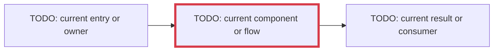
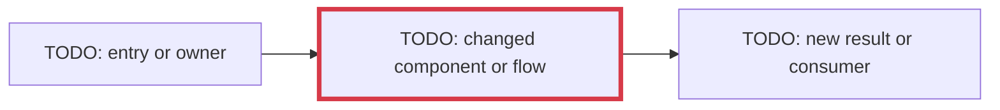

<!--
Every PR must keep one or more Mermaid diagrams that collectively show:
1. the relevant architecture/flow before this PR;
2. the relevant architecture/flow after this PR; and
3. the changed or risky areas reviewers should inspect most closely.

Replace every TODO below. If the PR does not alter runtime architecture, use
the affected authoring, build, test, release, or documentation flow and label
the architectural boundary that remains unchanged. Verify the diagrams in the
GitHub preview before submitting the PR.
-->

## Summary

<!-- TODO: What changes, and why is it needed? -->

## Before

<!-- Replace every label. Apply the `focus` class to what this PR will change. -->

## After

<!-- Replace every label. Apply the `focus` class to the review-critical changes. -->

## Review focus

<!-- Every item should correspond to a highlighted node, edge, or boundary. -->

- **TODO: highlighted area:** Explain the invariant, risk, tradeoff, or behavior
  reviewers should verify.

## Validation

<!-- List the tests, checks, benchmarks, or manual validation performed. -->

- TODO

## PR-description checklist

- [ ] I replaced every `TODO` and tailored both diagrams to this PR.
- [ ] The diagrams accurately show the relevant before and after states.
- [ ] Review-critical changes are visually highlighted and explained.
- [ ] Both Mermaid diagrams render correctly in GitHub's preview.
