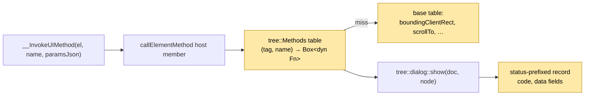
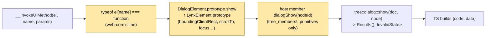

# Per-kind element methods: design options (2026-10-09)

**Status: Implemented 2026-10-09 per §9.**

The question: in a browser, `HTMLDialogElement.prototype.show` exists and
`HTMLDivElement.prototype.show` does not, and a custom element adds methods on
its own class. This engine has one mechanism for element methods today, and it
is neither per-kind nor extensible. This document compares the ways Rust can
give element kinds their own methods, what the references do, and the two
coherent architectures that fit this repository's policies.

## 1. Where the engine stands

| Fact | Where |
| --- | --- |
| One host member, `callElementMethod(nodeId, method, paramsJson)`, hand-matches the method name with a tag guard (`"selectTab" if is_viewpager`, `"show" \| … if is_dialog`) and falls to code 3. | `crates/bobcat-core/src/main/runtime/lib.rs:2108-2202` |
| The answer is a `number` status or a string the realm always decodes as a rect; no method can return other data. | `packages/bobcat-element/src/native.d.ts:87`, `element-papi.ts:1636-1655` |
| Components are `impl dom::CustomElement<()>` with lifecycle callbacks and `handle_event`; the trait has no method surface. `Document::define` stores `Arc<dyn CustomElement<T>>`; the per-element handler lookup is `pub(crate)`. | `crates/dom/src/tree/custom.rs:130, 362-390, 589-606` |
| An element in script is a plain object `{ [nodeIdSymbol]: id }` on `Object.prototype`; no per-tag prototype. | `packages/bobcat-element/src/element-papi.ts:577-588, 698-700` |
| The bridge installs flat host functions only. It has no object, array, class or prototype builder; `HostValue::Structured` is opaque bytes Rust cannot build or read. | `crates/quickjs-rust-bridge/src/lib.rs:630-670, 1735-1909` |
| Policy: payloads JS consumes stay opaque in Rust; expose Rust facts as primitive binding arguments and build the object in JavaScript. | `AGENTS.md:135-143` |
| Policy: no `impl CustomElement` and no definition table may live in `dom`; `bobcat-core::tree` owns the component handlers. | `docs/dom-public-api.md:27` |
| Pending method set: about 25 names over 9 kinds; at least four return data (`getValue`, `getVisibleCells`, `getScrollContainerInfo`, `getScrollInfo`). | `docs/tracking/components.md`, §6 below |
| `docs/tracking/js-runtime.md:224-226` already records that a fixed enum under-serves this and asks for an open or explicitly registered per-widget dispatch. | |

## 2. What the references do

| Reference | Where methods are declared | How the name is resolved at call time | How shared methods are inherited | Error shape |
| --- | --- | --- | --- | --- |
| Lynx iOS (`LynxUIMethodProcessor.m:40-107`) | `LYNX_UI_METHOD(name)` on `LynxUI` subclasses and categories | Objective-C reflection: scan the class's own methods for the generated selector, cache per class, walk superclasses up to `LynxUI`; the subclass is checked first | `LynxUI` base: `boundingClientRect`, `requestUIInfo`, `scrollIntoView`, `takeScreenshot`, accessibility, `innerText` | `callback(code, data)`; 3 plus a message for an unknown name; an exception gives no callback |
| Lynx Android (`LynxUIMethodsProcessor.java:115-211`) | `@LynxUIMethod` methods; `@Inherited @LynxUIMethodsHolder` on `LynxBaseUI` | Annotation processor emits `<Class>$$MethodInvoker` with a `switch` over the class and all superclasses, found by `Class.forName`; reflection fallback | The processor merges superclass methods; subclass wins on a duplicate name | `{code, data?}`; 3 for missing, 4 for a bad signature, 1 on exception |
| Lynx Harmony (`ui_base.cc:180-184, 1955-1964`) | C++ `ui_method_map_` plus `virtual InvokeMethod` overrides; ArkTS `invokeMethod(...) -> bool` | Override handles its names, then calls `UIBase::InvokeMethod` | Three base methods in `UIBase`'s map | `callback(code, value)`; 3 plus message |
| web-core (`createInvokeUIMethod.ts:9-45`) | Plain methods on `@Component` `HTMLElement` subclasses; no registry | `boundingClientRect` special-cased; otherwise `typeof element[method] === 'function'` over the JS prototype chain | Every inherited `HTMLElement`/`Element` method is invocable (`focus`, `scrollBy`, `remove`, …) | `{code, data}`; 3 missing, 4 for any throw; codes 0–6 only |
| Paws (`wit/paws.wit`, `engine/src/dom/element.rs`) | None on the host; typed guest wrappers (`PawsInputElement::set_value`) over generic id-keyed WIT calls | Static Rust dispatch in the guest | `NodeOps`/`ElementOps` traits with default bodies | Negative `s32` codes |
| HTML/WebIDL | Interface prototype objects (`HTMLDialogElement.prototype`); the author's class for a custom element | ECMAScript `[[Get]]` up the prototype chain | `HTMLElement` → `Element` → `Node` prototypes | Thrown `TypeError`/`DOMException` |

Every reference resolves a method against an inheritance chain of per-class
tables: a class walk on iOS, a merged generated `switch` on Android, the
prototype chain on web. None keeps a central engine-wide `match`. The
shared status codes are `LynxGetUIResult` 0–8
(`lynx/core/renderer/dom/lynx_get_ui_result.h:53-61`); web emits 0–6.

Three drifts found in `docs/tracking/js-runtime.md` while re-verifying:
line 228 should cite `web-core/ts/constants.ts:83-91`; line 268 is wrong that
web's `boundingClientRect` carries `dataset` (only iOS adds it,
`LynxUI.m:1491`); line 293 is wrong that `focus`/`blur` are not invocable on
web (`XInput.ts:103-109` overrides them, and `HTMLElement.prototype.focus`
resolves anyway).

## 3. How Rust projects give kinds their own methods

| Mechanism | Declared as | Found by name | Base methods shared by | Extensible from another crate | wasm32 | Main cost |
| --- | --- | --- | --- | --- | --- | --- |
| Servo WebIDL codegen | `.webidl` + `impl HTMLDialogElementMethods<D> for HTMLDialogElement` | JS prototype lookup → generated trampoline → static call; `this` check is an O(1) prototype-id range test | JS prototype chain; parent struct as field 0; `Castable` ranges; `VirtualMethods::super_type` for hooks | No (regenerate); custom elements add methods in JS only | n/a | A Python generator and one binding module per interface (575 IDL files) |
| Blitz `SpecialElementData` | Closed enum + `match`/`local_name!` in the mutator | `match` | None (flat) | Only `Box<dyn Widget>` with fixed hooks | yes | Lowest; closed set, no method surface |
| blitz-vibey-script (Boa) | `define_method(proto, "name", f)` | JS prototype lookup | One `Element` prototype for all tags; tag branch inside the fn | by hand | yes | `div.value` resolves too |
| deno_core `#[op2] impl` | Attribute macro → static `OpMethodDecl` table | V8 `FunctionTemplate` prototype, `tmpl.inherit(parent)` | `#[op2(inherit = Base)]`, `#[repr(C)]` field 0, `TypeId` list via `inventory` | yes | not targeted | proc macro; life-before-main registry |
| Boa / rquickjs / napi-rs classes | Attribute macro or `ClassBuilder::method` | Engine prototype lookup; exact-type unwrap | Inheritance wired by hand (`ConstructorBuilder::inherit`, custom `JsClass::prototype`), none in napi-rs | yes | yes (napi via emnapi) | macro; no cross-class `is-a` on the Rust side |
| pyo3 `#[pymethods]` | Attribute macro → static method tables | CPython MRO | `#[pyclass(extends = Base)]`, nested layout, `as_super()` | yes | yes, except `multiple-pymethods` (`inventory`) | macro |
| web-sys (WebIDL → `extern`) | Generated inherent fns, one file per interface (1726) | None in Rust: one JS shim per member | `Deref` to the first `extends`; `AsRef`/`From` to every ancestor | Own `extern` type with `extends` | wasm32-unknown only | Code size, feature flags |
| `dyn Trait` + `Any` downcast | Trait methods | None; caller downcasts by exact `TypeId` | Default methods / delegation | New types yes | yes | No `is-a` for subtypes |
| `enum_dispatch` | Trait + enum → generated `match` | `match` | Default methods | No: closed set, same crate | yes | Fastest |
| `inventory` / `typetag` | `submit!` registry | Iterate | User-defined | yes | Supported, but `__wasm_call_ctors` must run on reactor modules; typetag #97 open | Life-before-main |
| `linkme` | `#[distributed_slice]` | Link-time slice | User-defined | yes | **no** (platform table; wasm PR closed unmerged 2026-05) | — |
| Hand table `&'static [(&str, fn)]` or `HashMap<name, Box<dyn Fn>>` per kind | Table per kind | Search / hash, parent table as fallback | Parent-table fallback | Runtime `register` | yes | Boilerplate; a compare per call |
| Capability query `fn as_dialog(&self) -> Option<&dyn DialogMethods>` | Method on the base trait | Vtable call | Default `None` | Existing capabilities only; a new one edits the base trait | yes | One base-trait edit per interface |
| gtk-rs `IsA<T>` + `WidgetExt` | GIR-generated extension traits with blanket impls | Static; GType for downcast | `impl<O: IsA<Widget>> WidgetExt for O` | Subclass yes | no | GIR codegen |
| Masonry | Associated fns on `WidgetMut<Self>` after `downcast` | None by name | None | yes | yes | — |

Two conclusions for this repository:

- **`linkme` is out and `inventory` is fragile on wasm32.** The repository's
  component list is already an explicit ordered call list with an ordering
  constraint (`dialog` before `overlay`, `tree/lib.rs:79-85`), which a
  distributed registry cannot express. No registry crate is needed: all
  definitions are created on the engine thread inside one job.
- **Every binder that reaches a JS engine resolves names on the JS side.**
  Servo, web-sys, deno_core, Boa, rquickjs and napi-rs all put the method on
  a prototype and keep Rust typed. The only Rust-side string dispatch in the
  survey is Harmony's `InvokeMethod` chain and Blitz's tag compares, both
  without a script engine in front of them.

## 4. The candidate architectures

The decision has two independent halves: **how script resolves a name** and
**how Rust reaches the implementation**. Not every pairing is coherent, so
they are presented as whole architectures.

### 4.0 Status quo: central `match` (reference point)

Keep `callElementMethod`'s `match` and add arms. No structure to share base
methods, no data-returning envelope, every component couples to
`runtime/lib.rs`, and a wrong-tag call and a missing method are the same
code 3. Listed only as the baseline.

### 4.1 Rust catalog, generic invoke (Harmony/Android shape)



- **Script**: unchanged generic `__InvokeUIMethod`; the handle stays a plain
  object.
- **Rust**: a method table in `bobcat-core::tree`, filled by each
  `tree/*.rs` `define` beside the `CustomElement` registration (`dom`
  untouched). Lookup is the element's tag, then a base table every element
  shares. Entries are `Box<dyn Fn(&mut LynxDocument, NodeId, &str) ->
  Result<Reply, MethodError>>`, so an entry can capture `ComponentEvents`
  the way `Image`/`Overlay` already do at `define`.
- **Variant 4.1b**: put the dispatcher on the trait instead,
  `CustomElement::invoke(&self, document, element, name, params) ->
  Outcome` with a default of not-found and a `Document::invoke_element_method`
  that resolves the definition and opens a `[CEReactions]` scope. This
  touches `dom`'s public trait and makes `dom` own a generic outcome type;
  the method set is not enumerable.
- **Params and data**: JSON text in, parsed in Rust with `serde_json` as
  `select_tab` does today; out, a new envelope is unavoidable because a string
  answer is a rect today. A status-prefixed record (`write_record_field`)
  that `element-papi.ts` decodes per method name is the smallest change.
- **Errors**: `enum MethodError { NotFound, InvalidParams, InvalidState,
  Operation }` mapped to codes 3/4/7/8 in one place.
- **Costs**: stringly throughout; Rust parses JSON it does not need
  (`AGENTS.md:135-143`); the table and the tracking catalog are the same
  list in two places; nothing in script knows which tag has which method,
  so a future `customElements.define` in script cannot add methods without
  a second hook.
- **Gains**: a component adds a method by registering one closure; the
  catalog is data (testable, listable); the realm is untouched.

### 4.2 Prototype chain in TypeScript, typed members in Rust (web-core and Servo/web-sys shape)



- **Script**: `createHandle` does `Object.create(prototypeFor(tag))` instead
  of a literal. A `LynxElement` prototype carries what every element has
  (`boundingClientRect`, CSSOM-View `scrollTo`/`scrollIntoView`, `focus`
  when it exists); per-tag prototypes extend it (`DialogElement`,
  `ViewpagerElement`, `ListElement`, `InputElement`, …). `__InvokeUIMethod`
  becomes web-core's reflection: `boundingClientRect` special-cased, else
  `typeof el[name] === 'function'` → call, else 3; a throw → 4 (web-core)
  with `InvalidStateError` optionally 7 (native). A future
  `customElements.define` in script is a class extending `LynxElement`,
  found by the same line.
- **Rust**: one typed host member per method, generated by the existing
  `tree_members!` macro in a new `runtime/element_members.rs`, with
  primitive arguments (`viewpagerSelectTab(nodeId, index, smooth)`) and
  primitive or record answers; each calls the component's existing free
  function (`tree::dialog::show`, `tree::select_tab`). A member called on
  the wrong kind answers a `TypeError` (WebIDL's "illegal invocation"),
  which the prototype makes unreachable through `invoke`. `dom` and the
  `CustomElement` trait are untouched; `serde_json` leaves `viewpager.rs`.
- **Params and data**: TS decodes `params` per method and passes primitives;
  TS assembles data-returning results (`getVisibleCells` from a record), as
  `getComputedStyleMap` does today. This is `AGENTS.md:135-143` as written.
- **Errors**: Rust returns typed `Result<_, DialogError>` per method; the
  host member maps to a thrown realm error carrying the DOMException name;
  one TS `catch` maps names to Lynx codes.
- **Costs**: adding a method touches three places (component fn, binding
  member, TS prototype), which is Servo's shape minus the generator; the
  tag → prototype map in TS duplicates the tag → definition list in
  `tree/lib.rs`; a Rust-only downstream crate cannot add a method without a
  TS change (no such crate exists). One more crossing (`tagName`) when a
  handle is first created for an engine-made node, unless the host passes
  the tag with the id.
- **Gains**: name resolution and inheritance are the standard's own
  mechanism; a method on a tag that lacks it is unrepresentable rather than
  refused; the Rust side has no string matching and no JSON; data-returning
  methods need no envelope; errors are typed end to end; the hot
  `boundingClientRect` path is unchanged.

### 4.3 Typed interface traits in Rust (Servo's `*Methods` traits, no codegen)

A `DialogMethods { show, show_modal, close, request_close }` trait and a
`ScrollMethods` trait implemented by components, with capability queries on
`CustomElement` (`fn as_dialog(&self) -> Option<&dyn DialogMethods>`). This
is the inner-layer shape of Servo without its generator. It composes with
either 4.1 or 4.2 as the Rust side, but on its own it buys nothing over the
free functions the components already export: every interface needs a
base-trait edit, and the only consumer of the trait is the dispatcher that
would call the free function anyway. Not recommended as a separate layer;
recorded so the comparison is complete.

## 5. Comparison

| Criterion | 4.0 central match | 4.1 Rust catalog + generic invoke | 4.1b trait `invoke` | 4.2 TS prototypes + typed members |
| --- | --- | --- | --- | --- |
| Name resolution matches the standard (prototype chain) | no | no | no | **yes** |
| Base methods shared like `HTMLElement` | no | base table fallback | `Document` fallback outside the trait | **prototype inheritance** |
| Script-defined custom elements can add methods later | no | needs a second hook | needs a second hook | **free** |
| `dom` crate untouched (`dom-public-api.md:27`) | yes | **yes** | no | **yes** |
| `AGENTS.md:135-143` data ownership | JSON in Rust | JSON in Rust | JSON in Rust | **primitives, objects in TS** |
| Data-returning methods | impossible | new envelope | new envelope | **existing record path** |
| Error typing | codes | one `MethodError` enum | one dom outcome type | **typed `Result` per method, DOMException names** |
| Wrong-kind call | code 3 | code 3 | code 3 | unreachable via `invoke`; `TypeError` on the member |
| Places touched per new method | 1 | 1 (+ TS for data) | 1 (+ TS for data) | 3 |
| Rust-only downstream extensibility | no | **yes** | yes | no |
| wasm32 | yes | yes | yes | yes |
| Hot path (`boundingClientRect`) | unchanged | one table lookup | one definition lookup | unchanged |
| Test parity (§E of the constraints report) | — | runtime tests unchanged; TS mock changes | runtime tests unchanged | runtime tests unchanged; TS mock gains members; component unit tests unchanged |
| Migration from today | — | small | small | medium: `createHandle`, member split, 7 existing methods re-expressed |

## 6. The method set this sizes against

| Kind | Methods (web-core names) | Data? |
| --- | --- | --- |
| every element (`LynxElement`) | `boundingClientRect` (built), `scrollIntoView`, `scrollTo`/`scrollBy` (CSSOM-View), `focus`/`blur` where focus exists | rect |
| `dialog` | `show`, `showModal`, `close`, `requestClose` (built) | — |
| `viewpager` / `x-viewpager-ng` | `selectTab` (built), `setDragGesture` | — |
| `scroll-view` | `scrollTo` (Lynx overload), `autoScroll`, `getScrollInfo` (native) | yes |
| `x-list` | `scrollToPosition`, `autoScroll`, `getScrollContainerInfo`, `getVisibleCells` | yes |
| `x-refresh-view` | `autoStartRefresh`, `finishRefresh`, `finishLoadMore` | — |
| `x-foldview-ng` / `scroll-coordinator` | `setFoldExpanded`, `getScrollInfo`, `scrollBy` | yes |
| `x-input` / `x-textarea` | `addText`, `setValue`, `getValue`, `sendDelEvent`, `controlKeyBoard`, `setInputFilter`, `select`, `setSelectionRange` | yes |
| `x-audio-tt`, `x-markdown`, `x-webview` | playback / readback / `reload` | yes |
| `x-swiper`, `x-overlay-ng`, `x-image` | none in web-core | — |

## 7. Recommendation

**4.2.** It is the only option where the standard's own mechanism does the
name resolution and the inheritance, where the Rust side stays typed and
JSON-free as `AGENTS.md` asks, and where a data-returning method needs no
new wire envelope. Both references are per-class tables walked by
inheritance; a JS prototype chain is that walk, built once, and web-core's
dispatcher line can be copied verbatim. The cost is three edits per new
method and a tag → prototype map in TS beside the tag → definition list in
Rust; at about 25 methods over 9 kinds, that is a catalog the tracking docs
already maintain by hand.

If Rust-only extensibility by another crate becomes a requirement, 4.1's
table can be added later as the fallback the `LynxElement` prototype's
`invoke` reaches when no prototype method exists, without undoing 4.2.

## 8. Decisions this needs

1. The architecture: 4.2 (recommended), 4.1, or 4.1b.
2. Under 4.2, the status for a method that throws `InvalidStateError`: 4 as
   web-core (today's behaviour, recorded in `deviations.md`) or 7 as native.
3. Under 4.2, whether `LynxElement.prototype` exposes the inherited DOM
   methods web-core exposes by accident (`remove`, `setAttribute`,
   `addEventListener` through `invoke`), or only the documented UI methods.
   Recommended: only the documented set; web-core's reach-through is a side
   effect of `HTMLElement`, not a Lynx contract.
4. Whether the `tagName` crossing for lazily created handles is acceptable
   or the host should hand the tag back with the id in every member that
   returns node ids.

## 9. Rulings (2026-10-09) and the resulting shape

The user ruled, in the decision dialog:

1. **Architecture: 4.1b**, a virtual `invoke` on `dom::CustomElement<T>`.
2. **`InvalidStateError` answers code 7** (native's table), not web-core's 4.
   `docs/tracking/deviations.md` must be updated: the current 4 is replaced.
3. **The shared base set is the documented UI methods only**:
   `boundingClientRect`, `scrollIntoView`, `scrollTo`/`scrollBy`, and
   `focus`/`blur` where focus exists. web-core's reach-through to
   `remove`/`setAttribute` is not a contract.
4. The prototype question (§8.4) falls away: under 4.1b no prototype is
   chosen in script; the handle stays a plain object and `__InvokeUIMethod`
   stays generic.

The concrete shape this fixes (to be checked against the code when built):

```rust
// crates/dom/src/tree/custom.rs — new members on the public trait
pub trait CustomElement<T> {
    // … lifecycle callbacks and handle_event as today …

    /// One imperative method of this element kind: what `HTMLDialogElement`
    /// adds beyond `HTMLElement`. `NotFound` is the default, and the host
    /// answers the shared base set after it, so a kind that overrides a base
    /// name (`scroll-view`'s `scrollTo`) is asked first, as a subclass
    /// method shadows the base's.
    fn invoke(&self, document: &mut Document<T>, element: NodeId, call: MethodCall<'_>) -> MethodOutcome {
        let _ = (document, element, call);
        MethodOutcome::NotFound
    }
}

pub struct MethodCall<'a> { pub name: &'a str, pub params: &'a str }   // params = JSON text, parsed by the kind that reads it

pub enum MethodOutcome {
    NotFound,          // → 3
    Done,              // → 0, no data
    Data(String),      // → 0 + fields, a record the realm assembles per method name
    Failed(MethodError),
}

pub enum MethodError { InvalidParams /* 4 */, InvalidState /* 7 */, Operation /* 8 */ }

impl<T> Document<T> {
    /// Resolves `element`'s definition and runs its `invoke` inside one
    /// custom-element reaction scope, as `dispatch_element_event` does.
    pub fn invoke_element_method(&mut self, element: NodeId, call: MethodCall<'_>) -> MethodOutcome;
}
```

- `dom` keeps no table and no Lynx codes: the numbers live in
  `bobcat-core`'s `callElementMethod`, which maps `MethodOutcome` and then
  answers the base set on `NotFound`.
- A kind that needs `ComponentEvents` (dialog's `close`/`requestClose`)
  captures the clone at `define`, as `Image`/`Overlay` do; `Dialog` stops
  being a unit struct.
- `Data` needs the realm-side envelope §4.1 describes: a record whose first
  field is the code and whose remaining fields `element-papi.ts` decodes by
  method name. `boundingClientRect` keeps its string fast path.
- `docs/dom-public-api.md` row "Custom elements" gains `invoke`,
  `MethodCall`, `MethodOutcome`, `MethodError` and
  `Document::invoke_element_method`.
- Existing component functions (`tree::dialog::show`, `tree::select_tab`)
  stay as they are and remain the unit-test surface; each kind's `invoke`
  is a `match call.name` over them.
