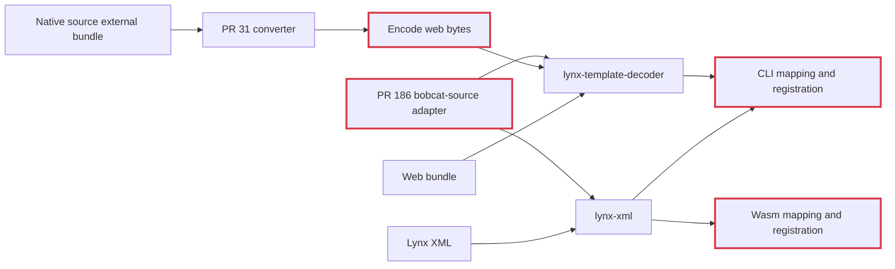
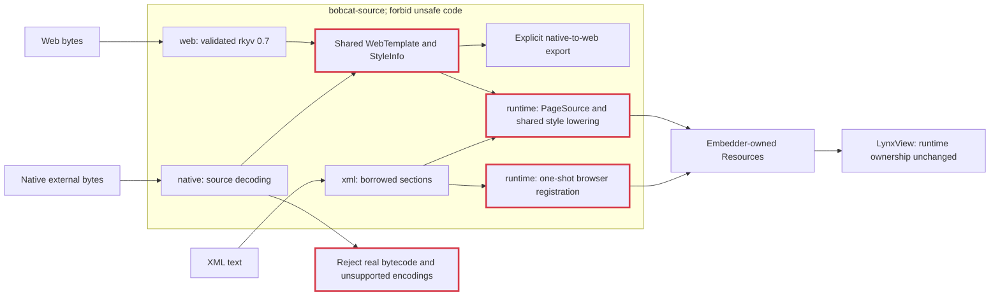

# Unified source boundary

`bobcat-source` incorporates PR 31 (`ef34104`) and only the source adaptation
and consumer integration from PR 186 (`3e381d6`). It replaces `lynx-xml` and
`lynx-template-decoder`; the proposed `lynx-template-converter` is incorporated
as a module rather than introduced as another package. No HTTP server is added.

## Before



The adapters duplicate mapping, and composing native conversion with a page
loader would serialize and validate an intermediate binary unnecessarily.

## After



The shared template is authoritative for decoded binary data. Its rkyv field
and enum order are unchanged. XML remains borrowed text; turning its verbatim
CSS into a restricted binary CSS model would lose source capabilities.

The two registration paths share parsing and URL mapping while retaining
explicit host policies. Native XML uses strict UTF-8 and private memory URLs,
retaining its background body. Browser XML uses already replacement-decoded
text and final-response fragments; it reports a background section but does
not copy or register its unused body. Browser PageConfig remains host-owned.

## API and dependencies

| Features (disable defaults to select) | API | Dependencies |
| --- | --- | --- |
| none | `xml::parse` | None |
| `web-bundle` | `web::decode`, wire types | rkyv 0.7, bytecheck, JSON and errors |
| `native-bundle` | `native::decode`, `native::convert` | Web model plus cssparser |
| `runtime` | `PageSource`, `register_lynx_xml_response` | Core, resources and URLs; binary formats optional |
| defaults | All of the above | Native embedder configuration |

A tooling consumer can parse either binary without depending on Bobcat's GPU
or runtime. Wasm enables only `runtime`; neither binary parser nor rkyv enters
its normal dependency graph. Core only dev-depends on the web parser for its
bundle fixtures. Transport, text decoding policy, font/image resources and
view construction remain outside the format parsers.

Migration:

- `lynx_xml::parse` → `bobcat_source::xml::parse`.
- `lynx_template_decoder::{decode, ...}` → `bobcat_source::web::{decode, ...}`.
- `lynx_template_converter::convert` → `bobcat_source::native::convert`.
- Native consumers should prefer `native::decode` when they want the decoded
  template, avoiding a native → web bytes → decoded web round trip.
- `PageSource::from_bytes` requires the binary page's `root` entry. Native
  external libraries normally have named modules instead; use
  `PageSource::from_native_bundle(input, bytes, entry_name)` to explicitly
  select one. Selection does not implement runtime chunk imports or a
  background realm. The low-level decoder retains all named modules.

```sh
cargo run -p bobcat-source --no-default-features --features native-bundle \
  --example convert -- input.lynx.bundle output.web.bundle
```

## Review fixes and trust boundaries

- Native attribute selectors now retain their brackets in the shared wire
  model. Identifier and string escaping preserve literal punctuation and
  newlines instead of changing selector meaning.
- CSS tokenization rejects nesting at 64 levels before recursing. CSS variable
  fallback restoration limits recursion and all appended expansion work to
  1 MiB per declaration; depth alone does not prevent exponential expansion.
- Native top-level and custom payload ranges cannot overlap. Otherwise many
  descriptors could copy the same large body repeatedly. Custom headers are
  decoded once, scanned for bytecode, then used to decode their payloads.
- Native Lepus value nesting remains bounded at 128; counted allocations are
  checked against bytes remaining. Legacy Lepus and real QuickJS bytecode are
  explicit errors; only the exact known inert external-root stubs are allowed.
- Web StyleInfo retains its 1 MiB section cap, sized validation stack, and
  64-level returned-rule cap. XML retains its UTF-8-boundary and borrowing
  invariants, tested with 20,000 deterministic mutations.

Unsupported native CSS encodings remain errors rather than partially converted
stylesheets. The native external decoder does not promise full native-card or
bytecode compatibility. Native conversion still exports the established web
wire format, including named external modules rather than inventing a root.

## Validation

- Default source suite: 121 tests and 2 doctests passed, including native
  conversion, malformed input, selector escaping, keyframes and font faces.
- XML-only, web-only, native-without-runtime and XML/runtime suites passed.
- CLI unit suite: 17 passed. CLI headless rendering and core bundle boot:
  3 tests each passed after granting GPU access outside the sandbox.
- Native source/CLI Clippy and browser-target XML/runtime Clippy passed.
- Worker/config JavaScript tests: 7 passed. Normal Wasm dependencies contain
  `bobcat-source` without rkyv or bytecheck; XML-only has no normal dependencies.
- Workspace all-target check, formatting, diff whitespace and benchmark-feature
  parity checks passed. The entire unrelated workspace test suite was not run.
- The local production `react-externals/dist/comp-lib.lynx.bundle` was rejected
  as `CodeCacheBundle` at `./App.js__main-thread`, as required. Successful
  native conversion is covered by synthetic source fixtures; the vendored
  web fixtures remain unchanged real encoder outputs.
