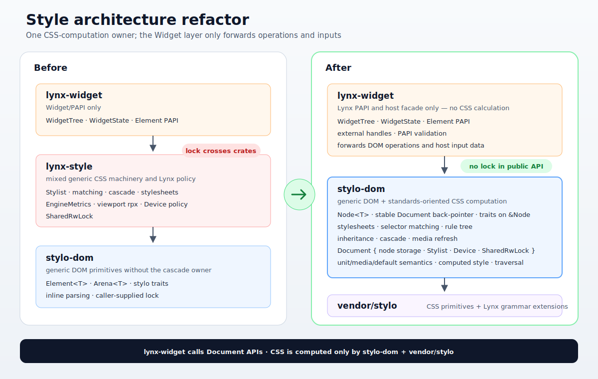

# Style architecture

The style layer has one standards-oriented core and one Lynx adapter:

```text
lynx-widget  ───────▶  w3c-dom  ───────▶  vendor/stylo
Lynx policy            DOM + CSS core     parser/cascade primitives
```

The previous standalone `lynx-style` crate has been removed; its generic
stylesheet/matching/cascade implementation lives in the DOM core, its
Lynx-only device and unit behavior in `lynx-widget`. The core itself was
subsequently rebuilt from the arena-based `stylo-dom` into `w3c-dom`, a
Document/Node design (this document describes the current shape).



## The w3c-dom core: one tree, Document-mediated mutation

- **ONE TREE policy.** `Document<T>` owns one fixed-address `Box<Slab<Node<T>>>` and one private
  style engine (`Stylist` + device + stylesheets + `SharedRwLock` + base URL). Slot zero is the
  real `NodeData::Document`; its ordinary child list contains the optional root element and carries
  the lock/base-URL context needed by its nodes. All later slots are element
  or text nodes, addressed by their raw `usize` slab index. Each
  pending pre-mutation snapshot is owned by its node in a pointer-sized optional box, allocated
  only when a previously styled element is first mutated between flushes. There is no separate
  arena/tree object, and no public way to construct or mutate a `Node<T>` outside its document —
  `Document::create_element` and `Document::create_text_node` are the kind-specific factories,
  and every DOM operation is a `Document` method.
- **Invalidation is carried by the operations.** Each matching-relevant setter
  (`set_classes`, `set_attribute`, `set_state`, `set_inline_style`, structural
  `insert_before`/`detach`/`remove_subtree`, …) records its own pre-mutation snapshot or scoped
  restyle hint before touching the node. "Snapshot before mutating" is enforced by construction,
  not asked of embedders. Selector-visible attributes always live in the real node attribute map,
  whose names are interned as stylo `LocalName`s. Lynx's `l-css-id` and `data-*` values are written
  through `Document::set_attribute`, never synthesized from the opaque payload during matching.
  Stylesheet and device operations are methods on the owning document and schedule its root
  internally in the same call. `Document::new` constructs a fresh style engine/context, so
  different documents cannot share stylesheets. Embedders cannot set, clear, or query the core's
  pending style state.
- **Payloads are opaque to the DOM core.** `Node<T>` retains the embedder payload supplied at
  creation and exposes it through a shared reference for non-DOM state such as leaf measurement.
  `w3c-dom` neither mutates that payload nor asks it to synthesize selector-visible state. IDs,
  classes, inline style, Lynx CSS scope (`l-css-id`), and dataset entries (`data-*`) are ordinary
  DOM attributes and change only through the corresponding `Document` mutation APIs.
- **Let it crash.** Query methods return `Option`; mutation methods treat vacant/out-of-range
  `NodeId`s,
  cycle-creating links, a second document element, and invalid insertion references as
  caller bugs — `debug_assert!`ed and panicking rather than silently ignored. Layers holding
  untrusted handles validate first (`WidgetTree` maps violations to `WidgetError`, including its
  Lynx-specific `<page>` root protection).
- **Identity and lifetime are context-owned.** `NodeId` is a raw `usize` slab index. It carries no
  document token and no allocation generation: after a node is removed and its slot reused, the
  same number names the new occupant. Separate JS contexts do not exchange handles, and a native
  `WidgetHandle` carries its context's `Reaper` owner while retaining its node, so no live handle
  survives reclamation and a host-side routing bug is rejected outside the DOM. The private style
  lock is created and owned by the same document, so there is no externally pairable engine token.
- **Debug contract instrumentation.** The `stylo_data` `UnsafeCell` slot carries a debug-only
  guard (reader/writer state, owning thread, unwind poisoning) and the document a debug
  traversal-phase flag; violations of stylo's one-worker-per-element discipline crash debug
  builds instead of being UB. Release builds compile it all away.
- **Slab backpointers, one-word handles, no mirror tree.** Every node carries a pointer directly
  to the fixed-address slab, so it can resolve parents/children and recover slot zero using only
  `&Node`. The same **`&'a Node<T>`** implements Stylo's `TNode`, `TElement`, `TDocument`, and
  `TShadowRoot` associated-type stub; `NodeData` decides whether that node is the document, an
  element, or text. No `Core`, document/node view, or iterator adapter exists. The
  restyle traversal runs **in place on the document**; no second tree is materialized. Text nodes
  remain in DOM/layout child iteration but are skipped by selector matching and cascade. The
  word-sized `TElement` handle is load-bearing: stylo's style-sharing cache sizes its TLS for a
  one-word handle (`FakeCandidate` in `style/sharing/mod.rs`), and a shared reference is exactly
  that (and `Copy` by nature).

## Ownership boundaries

| Layer | Owns | Must not own |
| --- | --- | --- |
| `w3c-dom` | `Document<T>` (fixed-address node slab + private `StyleEngine`/device/stylesheet/lock context), slot-zero document `Node<T>` (ordinary child list + node-visible style context), element/text nodes (including opaque embedder payloads and node-owned pending snapshots), raw-index `NodeId`, direct `&Node` Stylo DOM traits, invalidation-carrying DOM mutation, inline parsing, `Stylist`, rule matching, cascade, media evaluation, computed values, the **damage vocabulary** (`StyleDamage`/`FlushSummary`) + `effective_containment` derivation | Lynx tags/PAPI, payload semantics or mutation, payload-derived selector state, `<page>` root policy, Lynx unit metrics, touch-device policy |
| `lynx-widget` | `Document<WidgetState>` through `WidgetTree`, the semantics and interior synchronization of the node-carried `WidgetState`, PAPI validation plus its own `<page>` root, `WidgetHandle` (canonical registry, context ownership, node retention, drop-driven reclamation of detached subtrees), `EngineMetrics`, touch-first `Device` construction, viewport-relative `rpx` integration | A second stylist, cascade implementation, stylesheet lock sharing, direct node construction, raw-id public APIs, writes to w3c-dom styling/traversal state |
| `vendor/stylo` | CSS grammar, selector/rule-tree/cascade primitives, the maintained Lynx CSS extension patch set **and the Lynx supported-property/value grammar definition** (`style/properties/lynx_properties.txt`, `lynx` feature gates) | Runtime Widget/PAPI policy |

## Style lifecycle

1. `lynx_widget::StyleEngine::new(EngineMetrics)` (or `with_page_config`)
   retains the metrics and `PageConfig`; it owns no Stylist or stylesheet.
   Page config is never an engine branch.
2. Every `StyleEngine::new_widget_tree()` constructs a touch-first stylo
   `Device` — its viewport is the `rpx` basis — and passes it to
   `w3c_dom::Document::new`. That document immediately owns a fresh private
   `StyleEngine` (`Stylist`, device, stylesheet set, base URL, and
   `SharedRwLock`). Creating another tree, even from the same Lynx adapter,
   creates another complete context; no stylesheet object is shared. The
   adapter then installs the **UA-origin default sheet** generated from `PageConfig`
   (`defaultDisplayLinear`, `defaultOverflowVisible`; see
   `crates/lynx-widget/src/ua.rs`). Neither `lynx-widget` nor callers receive
   the lock. The resulting `Document<WidgetState>` keeps each widget's
   Lynx-only identity/event payload on its `Node<WidgetState>`, but the core
   treats that payload as opaque and read-only. `WidgetTree::create_page`
   records `<page>` as the Lynx-layer root and attaches that ordinary element
   beneath the generic DOM document node.
3. `StyleEngine::load_style_info(&mut tree, &StyleInfo)` ingests a decoded bundle by
   **direct construction** (`crates/lynx-widget/src/ingest.rs`): one selector
   parse per rule + per-property value parses into stylo rule objects — no
   CSS-text re-serialization. Lynx policy applied at ingest: `@import`
   flattening (Kahn, web-core parity) and cssId scoping via
   `:where([l-css-id="N"])` guards on the subject compound. The rules mount
   through the fork's `StylesheetContents::from_rules` +
   `w3c_dom::Document::append_rules` on that tree's document.
4. DOM mutations schedule style work as part of the `Document` methods that
   perform them (`crates/w3c-dom/src/invalidation.rs`): attribute / class /
   id / pseudo-state changes record a **pre-mutation snapshot on the affected
   node** for stylo's invalidation sets; structural changes post **restyle
   hints** scoped by the selector flags stylo recorded during matching;
   inline-style updates post the style-attribute replacement hint. These
   scheduling details are private to the core: embedders receive neither dirty
   queries nor reset APIs. Stylesheet insertion and device mutation are methods
   on the owning document and schedule its root subtree in the same
   operation; no generation broadcast or adapter-managed dirty callback exists.
5. `StyleEngine::flush_widget_tree(&mut tree)` delegates to
   `Document::flush_styles`, which drives **stylo's own restyle
   traversal** (`crates/w3c-dom/src/flush.rs`) from `Document::root_element()`, the first element
   child of the slot-zero document node:
   reachable pending node snapshots are moved along the dirty spine into the
   temporary map required by stylo's traversal API, followed by
   snapshot-driven invalidation, the style sharing cache, bloom filter, and
   rayon parallelism over wide DOM levels (stylo's global style pool).
   Computed styles land in each element node's stylo `ElementData`; read them with
   `WidgetTree::computed` (an `Arc<ComputedValues>` clone — direct Arc reads
   per `docs/style-assumptions.md` §B.8). The underlying document flush returns
   a **`FlushSummary`** — the
   per-node `StyleDamage` the change produced (a diff-based restyle damage
   class: repaint / stacking-context rebuild / overflow recalc / relayout,
   cumulative) plus a `traversed` flag, keyed by `NodeId`. Initial styling of
   a subtree reports **no** damage by design (no old values to diff); a later
   geometry/`display` change reports the matching damage on the affected
   nodes. Harvest immediately consumes relayout-class entries into incremental
   layout invalidation before exposing the summary, so a later layout stays
   correct even when an independent flush's return value is discarded. The
   summary is *not* `#[must_use]`, and
   `Document::flush_styles_with_sink` streams the same damage without allocating the
   `Vec`. **Damage stays inside the engine layer**: `lynx-widget` is the
   web-core analogue over `w3c-dom`'s browser-DOM analogue, so
   `flush_widget_tree` neither forwards nor re-exports the damage vocabulary
   — style→layout damage flow is `w3c-dom`'s internal seam, not PAPI surface.
6. **Harvest is the tail of the flush** (the crate-private
   `Document::harvest_flush`): after the traversal returns it walks the dirty
   spine from the traversal's *actual* root (`driver::traverse_dom`'s return
   value — stylo can raise a flush root to its parent when the root's
   snapshot invalidated siblings; for the document element the raise is
   structurally impossible — it has no element siblings, and stylo resolves
   the substitute via `parent_element_or_host()`, `None` for the document
   element — so the harvest follows the driver's returned root purely by
   contract, as insurance for a future subtree-flush entry point), reads each
   visited node's `ElementData::damage`, copies it out, then **clears** stylo's
   per-node restyle state (hint + damage + flags) and the `dirty_descendants` /
   snapshot bits. The copied relayout-class damage drives boundary-stopped
   `Document::invalidate_layout` (plus the parent for a reconstruct), and all
   copied damage remains exposed through the summary/sink. Clearing damage is
   not optional — see the invariant below.
   There is no public whole-document scheduling reset: only a successful flush
   harvests the state that traversal consumed.
7. `w3c_dom::Document::resolve_style` remains a read-only standalone match+cascade
   helper for core-level inspection. It does not write a node's computed style
   or participate in traversal scheduling, and `lynx-widget` does not expose a
   widget-specific wrapper. Computed values stored on nodes are written only by
   the normal style traversal and read through `WidgetTree::computed`.

## Invariants

- `Document::new(device)` constructs and owns a fresh style engine/context.
  A `Document` cannot be constructed around an existing context, and the
  internal engine cannot be extracted, so different documents cannot share
  stylesheets.
- `SharedRwLock` is an implementation detail of `w3c-dom`; embedders do not
  construct, pass, or read it.
- Standard CSS behavior belongs in `w3c-dom`. Lynx-only extensions and
  environment policy belong in `lynx-widget` (or the maintained stylo fork
  when they are first-class CSS grammar/value extensions — the fork's
  `lynx_properties.txt` + `lynx` feature gates are the source of truth for
  which properties/values the Lynx grammar supports).
- Device mutations go through `Document::update_device` or `set_viewport`,
  ensuring media-dependent cascade data is refreshed and that document is
  scheduled immediately. Thus
  `rpx`/`vw`/`vh` lengths re-resolve and media-dependent rules re-match without
  an adapter-managed dirty operation.
- Snapshot-before-mutate is **internal** to the `Document` setters. Selector
  matching sees only actual DOM fields; an opaque `Node<T>` payload cannot add
  or override attributes. The core exposes no mutable-payload accessor through
  which an embedder could bypass that rule.
- Node state stylo touches through `&self` during a traversal is atomic; the
  `ElementData` slot is single-owner under stylo's traversal discipline
  (`SAFETY` notes in `w3c-dom`'s `traits`/`flush`). Concurrent parallel
  flushes are serialized process-wide (stylo's global pool keeps
  per-traversal state in worker TLS). This discipline is what upcoming
  parallel style resolving relies on — do not add non-atomic `&self`
  mutability to `Node`.
- **Clear damage on harvest.** stylo never clears restyle damage for a normal
  restyle, and in servo builds `element_needs_traversal`
  (`vendor/stylo/style/traversal.rs:226-228`) returns `true` for any element
  whose `ElementData` still carries non-empty damage. Without the harvest's
  clear pass, every previously-restyled node would be re-traversed on every
  later flush forever. The regression guard: an incremental flush reports
  non-empty damage; an immediate second flush reports an empty summary with
  `traversed == false`.

## Performance posture (see `docs/style-assumptions.md`)

- Ingestion: direct construction, §B.5. Parallel traversal from day 1, §B.6.
- Incremental restyles ride stylo invalidation sets, §B.7 — a class flip on
  one element restyles only affected elements (~3µs per logical operation on
  a 1.1k-widget tree, vs ~1.1ms for the initial full flush). The Divan benches
  batch short operations into millisecond-scale samples and expose the batch
  size through an item counter, so this per-operation figure is derived from
  throughput rather than a flaky microsecond sample.
- Damage harvest is a spine walk over already-dirty nodes, so it costs
  nothing on clean subtrees. Clearing damage on harvest also makes a repeat
  flush a **true no-op** (the scheduling token short-circuits, no traversal
  runs) — `noop_flush` measures exactly that floor.
- Benchmarks: `cargo bench -p lynx-widget` (`benches/style.rs`,
  CodSpeed-tracked) — ingestion, initial flush (sequential + parallel),
  incremental class flip (relayout) / **class flip repaint-only** (two
  color-only fixture rules, the layout-skippable fast path) / inline style,
  no-op flush floor; each incremental scenario
  `black_box`es its `FlushSummary` so the harvest cost is measured — plus
  `cargo bench -p w3c-dom` (`benches/css.rs`) at the engine level, including
  the core's read-only standalone resolve baseline. No
  native-C++-Lynx comparison harness yet (§E.18 is the bar; harness is
  follow-up work).
