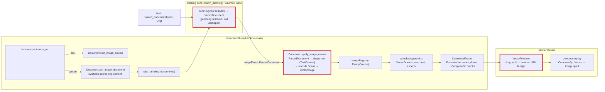

# SVG as the Lynx `<svg>` component: design (2026-10-09)

Status: in implementation. This document supersedes
`docs/svg-vector-images-design.md`, whose revision 3 (the standard inline
`<svg>` element whose DOM subtree is serialised and parsed by `usvg`) is
withdrawn. Rulings in this document were made by the project owner on
2026-10-09; everything else is the architect's decision and is marked so.

## Why the inline element goes

Both references treat an SVG as one picture, never as a DOM subtree. web-core
maps the Lynx tag to its `x-svg` element (`web-core/src/constants.rs:50`,
`("svg", "x-svg")`), a shadow `` that observes only `src` and `content`
(`web-elements/src/elements/XSvg/XSvg.ts:20`), renders no light-DOM child and
fires `load` with `{ width, height }`. Native renders `<svg src|content>`
through ServalSVG at the element's layout size. Under the standards policy the
Lynx `<svg>` is a Lynx-only component (bucket 2) that merely shares its name
with the HTML element; revision 3 extended it into something neither reference
has, at the price of three retained copies of every picture (DOM nodes, `usvg`
tree, vello scene), a serialise-and-reparse of the whole subtree at the start
of every layout after any mutation, and a mutation tracker over SVG children.

Measured on 2026-10-08 (release, Apple silicon) for a 47 KB Illustrator export
with 346 nodes, 56 paths and 16 gradients: serialise 114 µs, `roxmltree`
56 µs, `usvg` 525 µs, scene encode 37 µs, per refresh; 67 KB `usvg` tree plus
73 KB scene retained, 140 KB transient. For a 192 B icon: 3.7 µs per refresh.

## Rulings (2026-10-09)

| Topic | Ruling |
|---|---|
| The `svg` tag | The Lynx `<svg>` component: `src` (URL) or `content` (markup), `load` with the element's layout size (the native detail, ruled 2026-10-08). Children generate no box and are never read, as in web-core's `x-svg`. No `error` event (web-core fires none). |
| Parser | An own converter in `dom` over `roxmltree` and `svgtypes`. `usvg` leaves the dependency tree. One converter for every SVG the engine draws: `<svg content>`, `<svg src>`, `<image src="x.svg">`, CSS `url(x.svg)`. |
| CSS inside SVG | Not read: presentation attributes only, no `<style>`, no `style` attribute. Native ServalSVG parity; web-core renders CSS through the browser, recorded deviation; the project keeps one styling engine, stylo, and does not add a second one for SVG. |
| Text | SVG `<text>`/`<tspan>` are drawn. Shaping is parley's, through the document's own `TextContext`, so glyphs come from the same fonts, the same `@font-face` registrations and vello's glyph cache as `<text>`. |
| Fonts (architect's choice under the owner's permission) | Font family, weight, style, stretch and size come from the SVG document's own presentation attributes, inherited down the SVG tree like `fill`; the host element's computed style is not read. The owner allowed either; this one needs no restyle hook on the host, keeps one scene per document shared by every element that draws it, and treats `<image src="x.svg">` identically. A missing `font-family` resolves through the document's default family. |
| Raster | The painter rasterises each vector image with vello `render_to_texture` at the device size of its destination box, caches the texture by `(image key, device width, device height)` under a byte budget with LRU eviction, and draws it as an image quad. The frame carries the scene, never pixels. |
| Removal | Everything that existed only for the inline element (`tree/inline_svg.rs`, `tree/svg_markup.rs`, the mutation hooks, the `width`/`height` presentational-hint reflection, the inline tests and golden) is deleted. |

## Architecture

## Contracts

### A. The component (`crates/bobcat-core/src/main/tree/svg.rs`)

Restored from the pre-revision-3 module (`git show ff7c88ee^:crates/bobcat-core/src/main/tree/svg.rs`), with these changes:

- `src` → `document.set_image_source(node, ImageRole::Source, Some(url))`, as before; the host fetches and reports `loaded_document(bytes, DocumentKind::Svg)`.
- `content` → `document.set_image_document(node, ImageRole::Source, content.as_bytes(), DocumentKind::Svg)` (contract B). No `data:` URL, no host round trip. An empty or removed `content` keeps the current source (web-core's `_handleContent`), as before; the last attribute written wins.
- `load` detail = the element's border-box layout size read at delivery, 0×0 without a box (as before). A `Failed` outcome fires nothing.
- UA rules: `svg { display: flex; }` and `svg > * { display: none; }`. `svg` stays in the shared box-rule block of `ua_sheet.rs`.
- Registered in `new_document` after `image::define`; `is_svg` returns for the runtime's load-detail branch.

### B. Engine-originated documents (`dom`)

- `Document::set_image_document(node, role, bytes: &[u8], kind) -> Option<ImageOutcome>`: computes a 128-bit content hash (two seeded `SipHasher` passes, or `blake`-free equivalent already in the lock), names the synthetic source `svg-content:<32 hex>`, creates the registry entry `Pending` if unknown and pushes `(source, Bytes, kind)` onto `pending_documents`, then binds like `set_image_source`. A known source (another element with the same markup, or a re-set) binds without a new parse. Identical icons repeated across a list parse once and share one scene and one raster texture.
- `Document::take_pending_documents() -> Vec<(Arc<str>, Bytes, DocumentKind)>`: drained by the runtime next to `take_wanted_images`. Natively `bobcat-core` runs each through the existing `parse_document` task (`main/page.rs`, `spawn_blocking`) and applies the result as a main job; on wasm32 the document parses them inline in `apply_image_events` exactly as it does a host `LoadedDocument`.
- Synthetic entries are forgotten when their last binder unbinds (refcount on the entry, replacing the explicit `forget_synthetic`). The `inline-svg:` prefix and the revision-3 synthetic machinery go.
- `SYNTHETIC_SOURCE_PREFIX` becomes `svg-content:`; `is_synthetic_source` stays so the registry never queues such a source into `wanted`.

### C. The converter (`crates/dom/src/render/svg/`)

Owner: F1. Replaces `paint/svg.rs` and the `usvg` parts of `render/image.rs`.

- `pub(crate) fn parse(bytes: &[u8]) -> Result<VectorDocument, SvgError>`: UTF-8 check, `roxmltree::Document::parse_with_options` (DTD allowed, as today), then one walk producing a `VectorDocument { natural: (u32, u32), viewport: (f32, f32), aspect: AspectRatio, items: Vec<Item>, has_text: bool }`. `natural` and `viewport` follow the existing `vector_sizes` rules (CSS Images 3 default sizing, 300×150 fallback, absolute units in/cm/mm/pt/pc to px); `viewport` is the `viewBox` size when present, else the natural size. `Send + Sync`.
- `Item` is a flat, pre-resolved command list in viewport units with absolute transforms, in paint order: `Path { shape: BezPath, transform: Affine, fill: Option<(Brush, Affine, Fill)>, stroke: Option<(Stroke, Brush, Affine)>, fill_first: bool }`, `PushLayer { blend, alpha, bounds: Rect, transform }`, `PushClip { shape: BezPath, rule: Fill, transform, isolate: bool }`, `Pop`, `Text(TextItem)`. Brushes are final peniko brushes: `objectBoundingBox` gradient units are resolved against the shape's `kurbo` bounding box at conversion; `userSpaceOnUse` against the viewport. Gradient `href` chains inherit stops and attributes. `spreadMethod` → `Extend`. A radial gradient's focal circle maps to peniko's start circle as today.
- Elements: `svg` (root and nested, `x`/`y`/`width`/`height`/`viewBox`/`preserveAspectRatio`), `g`, `a` (as `g`), `defs`, `symbol`, `use` (`href`/`xlink:href`, `x`/`y`, `width`/`height` for a `symbol`/`svg` target, recursion guarded by a reference stack), `path`, `rect` (`rx`/`ry`), `circle`, `ellipse`, `line`, `polyline`, `polygon`, `text`, `tspan`, `clipPath` (`clipPathUnits`, nested `clip-path`, children `path`/shapes/`use`/`text` as paths; a multi-child clip is the concatenation under `NonZero`, the documented approximation), `linearGradient`, `radialGradient`, `stop`, `switch` (first child whose `systemLanguage`/`requiredFeatures` are absent). `image`, `mask`, `filter`, `pattern`, `marker`, `style` (its text is never read), `title`, `desc`, `metadata` and unknown elements produce nothing; a group with `mask` is skipped with its subtree (an unmasked draw would show what the author hid), a `filter` is ignored, a `pattern` paint is `none`.
- Properties, with SVG inheritance (`inherit`, `currentColor` from `color`, `none`, `url(#id) <fallback>`): `fill`, `fill-opacity`, `fill-rule`, `stroke`, `stroke-width`, `stroke-opacity`, `stroke-linecap`, `stroke-linejoin`, `stroke-miterlimit`, `stroke-dasharray`, `stroke-dashoffset`, `paint-order`, `color`, `display`, `visibility`, `opacity` (group, not inherited), `mix-blend-mode`, `isolation`, `clip-path`, `clip-rule`, `transform` (not inherited), `font-family`, `font-size`, `font-weight`, `font-style`, `font-stretch`, `text-anchor`, `letter-spacing`. Source: the presentation attribute of the same name, and nothing else (ruling "CSS inside SVG"). Lengths: user units, `px`, `%` (of the viewport axis, or of the diagonal for `r`/`stroke-width`), `pt`, `pc`, `mm`, `cm`, `in`, `em`/`ex` of the element's font size (default 16, `ex` = 0.5 em).
- Parsing primitives are `svgtypes` 0.16: `PathParser` (arcs through `kurbo::SvgArc` → cubics), `Transform`, `Paint`, `Color`, `Length`/`LengthListParser`, `PointsParser`, `ViewBox`, `AspectRatio`, `Points`. A malformed path renders up to the error, as the SVG spec and `usvg` do.
- `TextItem { chunks: Vec<TextChunk>, transform: Affine }`, `TextChunk { text: String, x: f32, y: f32, dx: f32, dy: f32, anchor: Start|Middle|End, font: ResolvedFont { families: Vec<String>, size: f32, weight: u16, style: Normal|Italic|Oblique, stretch: f32 }, letter_spacing: f32, fill: Option<(Brush, Affine)>, stroke: Option<(Stroke, Brush, Affine)> }`. A `tspan` with an absolute `x` or `y` starts a chunk; `dx`/`dy` move the running position; only the first value of a list is read (documented subset). Whitespace follows `xml:space` default collapsing. `objectBoundingBox` gradients on text resolve against the chunk's advance box after shaping.
- `pub(crate) fn encode(document: &VectorDocument, shaper: &mut dyn TextShaper) -> Scene` and `pub(crate) fn opens_blend(document) -> bool` (the vello #1198 rule the layer around a whole-image draw needs). Text is drawn with `Scene::draw_glyphs` exactly as `paint/text.rs::draw_glyph_run` does (`font_size`, `normalized_coords`, `hint(false)`, brush and brush transform); `text-anchor` shifts the chunk by 0 / half / all of its advance.
- `pub(crate) trait TextShaper { fn shape(&mut self, text: &str, font: &ResolvedFont, letter_spacing: f32) -> ShapedLine; }` with `ShapedLine { runs: Vec<ShapedRun { font: parley::Font (or fontique FontData + index), size: f32, normalized_coords: Vec<i16>, glyphs: Vec<(glyph id, x, y)> }>, advance: f32 }`. `dom` implements it over the document's `TextContext`; `hughie` gains `text::shape_line(ctx: &mut TextContext, text, font, letter_spacing) -> ShapedLine` (a one-line `RangedBuilder` with `FontStack`, `FontSize`, `FontWeight`, `FontStyle`, `FontWidth`, `LetterSpacing`, then `break_all_lines(None)`) because the context's parley handles are `pub(super)`.
- `VectorImage { scene: Arc<Scene>, natural, viewport, aspect, key, opens_blend: bool }` with the existing accessors (`natural_size`, `viewport`, `scene`, `key`, `aspect`, `opens_blend`). No tree. Built on the document thread by `Document::apply_image_events` from `ImageEvent::ParsedDocument { source, document: Box<VectorDocument> }`, which is what `ImageEvent::parse_document(source, bytes, kind)` now returns on success (`Failed` otherwise); the name `LoadedVector` goes. A `LoadedDocument` applied directly (wasm32, dom tests) parses then encodes in the same call.
- A later `@font-face` registration does not re-shape already-encoded text (known gap, follow-up).

### D. The painter raster cache

Owner: F2. Precedent: `FilterTextures` in `crates/dom/src/render/blur.rs` (`bake_all`, the texture-backed `ImageData` registered with `renderer.override_image`, `mark_override_image_dirty`).

- Frame side (`paint/background.rs`, `paint/compose.rs`, `visual/frame.rs`): the three vector producers (`paint_replaced_content`, `paint_vector_layer` for backgrounds, the mask layer through `paint_pattern_layer`) stop appending `vector.scene()`. Each visible tile becomes a `VectorDraw { scene: Arc<Scene>, key: u64, viewport: (f32, f32), aspect: AspectRatio, opens_blend: bool, transform: Affine (item-local → device px), anchor: Point, extent: Size, area: ImageArea, alpha-aware sampler }` in `Presentation.vector_draws`, referenced by a new `ComposeOp::Vector { index, space }`. The clip pair and tile loop of today's `fill_vector_tiles` keep their shape; `MAX_TILE_FILLS` still caps the tile count. Culling, hit testing and seams see the op as they see `Image`.
- Painter side: `VectorTextures` (new `crates/dom/src/render/vector_textures.rs`), owned next to `FilterTextures` by `WindowGraphics` and `Headless`, persists across frames. Before composing a frame the painter calls `bank.prepare(frame, renderer, device, queue)`: for every `VectorDraw` it computes the device size `(w, h) = ceil(extent × the per-axis scale of transform)`, clamped to `MAX_RENDERABLE_DIMENSION`; a miss on `(key, w, h)` renders the scene into a fresh `Rgba8Unorm` texture of that size with `render_to_texture`, under the transform that maps `viewport` onto `w × h` by `aspect` (`none` stretches; `meet`/`slice` scale uniformly and align), wrapped in one `Normal` full layer when `opens_blend`, and stores it with its `ImageData` handle (empty blob, premultiplied alpha, `override_image`). Entries used by this frame are pinned; the rest are LRU-evicted when the byte total exceeds the budget (architect's default 64 MB on native, 32 MB on wasm32; a constant, not a setting). Eviction releases the override and the texture.
- Replay (`compose.rs::replay_ops`): `ComposeOp::Vector` looks the draw's texture up in the table the painter passes (as `filtered` is passed) and encodes it through the same path as `ComposeOp::Image` (`encode_draw` with the texture-backed `ImageData`, brush scale = extent / (w, h)); with no texture (budget exceeded for one giant draw) it encodes nothing.
- `Headless::render_frame` (tests, screenshots) bakes the same way, so goldens exercise the cache.
- A scene that is empty (nothing drawable) produces no draw at all, as today, so vello's `FORCE_NEXT_*` flags are never cleared by an empty append.

### E. Deletions and rewrites

Owner: O1, after C and D have merged.

- `dom`: delete `tree/inline_svg.rs`, `tree/svg_markup.rs`, `tests/inline_svg.rs`, `tests/screenshots/svg/inline.png`; remove the hooks in `tree/document.rs` (73-75, 133, 388, 516-517, 705, 881-883), `style/invalidation.rs` (447, 486, 554-555, 733, 744, 755-757), `layout/mod.rs` (77-84); remove the `usvg` dependency; rewrite `tests/svg_images.rs` for the component path and regenerate the four remaining goldens (inspect every PNG).
- `bobcat-core`: contract A; `main/tree/lib.rs` registration; `runtime/lib.rs` load-detail branch; `page.rs` drains `take_pending_documents` into the parse task; `page_tests.rs` SVG tests adapted; `ua_sheet.rs` tests.
- `packages/reactlynx-test-fixtures/src/react-svg`: rewritten to `<svg content={...}>` and `<svg src="...">` cards (inline children removed); `rsbuild.config.js` and `README.md` entries kept.
- Docs: `docs/svg-vector-images-design.md` replaced by a pointer to this document; `AGENTS.md` SVG paragraphs; `docs/tracking/components.md` (the `svg`/`x-svg` row), `docs/tracking/media-resources.md` SVG section, `docs/tracking/deviations.md` SVG entries, `docs/tracking/reactlynx.md:117`, `docs/browser-wasm.md` SVG notes, `docs/dom-public-api.md`.

## Ownership and sequencing

| Phase | Agent | Model | Owns | Must not touch |
|---|---|---|---|---|
| 1 | F1 | Fable 5.1 | `crates/dom/src/render/svg/**`, `render/image.rs` (`VectorImage`, `ImageEvent`, `parse_document`, apply), `visual/mod.rs::apply_image_events`, `crates/hughie/src/text/` (`shape_line`), `paint/svg.rs` (delete), workspace deps (`usvg` out; `roxmltree`, `svgtypes` in), the walker unit tests ported to the converter | `paint/background.rs`, `paint/compose.rs`, `visual/frame.rs`, anything in `bobcat-core` |
| 1 | F2 | Fable 5.1 | `paint/background.rs`, `paint/compose.rs`, `visual/frame.rs`, `render/vector_textures.rs` (new), `render/gpu.rs`, `render/blur.rs` (only if the bank shares code), `bobcat-core/src/paint/{graphics,lib,images}.rs` | `render/image.rs` beyond reading `VectorImage`'s accessors, `render/svg/**`, hughie |
| 2 | O1 | Opus 5.5 | Contract A, B and E | the converter and the raster cache internals |

Both phase-1 agents work against the `VectorImage` accessors committed in the base (`key`, `aspect`, `opens_blend`, `scene`, `viewport`, `natural_size`), so the two branches merge without a shared edit. F1 removes `tree()`; F2 never calls it.

## Memory and performance expectations

Per `<svg content>`: the `content` string once in the DOM attribute, one `Scene` per distinct document (73 KB for the 47 KB illustration, 304 B for an icon), one texture per distinct `(document, device size)` on the GPU (48 px icon at dpr 3: 83 KB; a 390 px illustration at dpr 3: 5.5 MB), nothing on the blocking pool after the parse. Document thread per `content` change: a hash, a bind, and at apply time the text shaping plus one scene encode (37 µs for the illustration). Painter: one `render_to_texture` pass per cache miss, then one quad per draw per frame.

## Known costs and follow-ups

- A texture is per device size: a `transform: scale()` animation on an ancestor samples the texture, so an item scaling from 0.8 to 1 (the swiper's `coverflow`) draws a 0.8-size raster upscaled during the animation. Native does the same. Follow-up if it shows: bake at the largest size an exported scale curve reaches.
- Text shaped before a later `@font-face` arrives keeps its fallback glyphs.
- `image` inside an SVG draws nothing; `mask`, `filter`, `pattern`, `marker` are not supported; `textPath`, per-character `x`/`y` lists, `dominant-baseline`, bidi reordering within a chunk are out.
- A `content` string is parsed once per distinct markup per document, never evicted while an element is bound to it.
