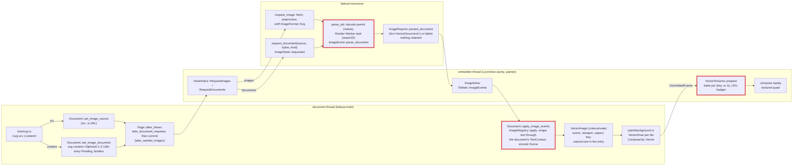

# SVG as the Lynx `<svg>` component: design (2026-10-09)

Status: implemented, PR #373; stack #375/#376/#377 merged. Every section
below describes the code at the tip of PR #373. This document supersedes
`docs/svg-vector-images-design.md` (revision 3, withdrawn). Rulings are the
project owner's; everything else is the implementers' or the architect's
decision and is not marked further.

## 1. Why the inline element went

Both references treat an SVG as one picture, never as a DOM subtree. web-core
maps the Lynx tag to its `x-svg` element (`web-core/src/constants.rs:50`), a
shadow `` that observes only `src` and `content`
(`web-elements/src/elements/XSvg/XSvg.ts:20`), renders no light-DOM child and
fires `load` with `{ width, height }`. Native renders `<svg src|content>`
through ServalSVG at the element's layout size. Under the standards policy
the Lynx `<svg>` is a Lynx-only component (bucket 2) that shares its name
with the HTML element. Revision 3 made it something neither reference has,
at the price of three retained copies of every picture (DOM nodes, `usvg`
tree, vello scene), a serialise-and-reparse of the whole subtree at the
start of every layout after a mutation, and a mutation tracker over SVG
children.

Measured on 2026-10-08 (release, Apple silicon) for a 47 KB Illustrator
export with 346 nodes, 56 paths and 16 gradients, on the revision-3
pipeline: serialise 114 µs, `roxmltree` 56 µs, `usvg` 525 µs, scene encode
37 µs, per refresh; 67 KB `usvg` tree plus 73 KB scene retained, 140 KB
transient. For a 192 B icon: 3.7 µs per refresh.

## 2. Rulings

| Topic | Date | Ruling |
|---|---|---|
| The `svg` tag | 2026-10-09 (`load` detail 2026-10-08) | The Lynx `<svg>` component: `src` (URL) or `content` (markup). `load` carries the element's layout size (native's detail). Children generate no box and are never read, as in web-core's `x-svg`. No `error` event (web-core fires none). An empty or removed `content` keeps the current source (web-core's `_handleContent`, ruled for web-core over native). |
| Parser | 2026-10-09 | An own converter in `dom` over `roxmltree` and `svgtypes`; `usvg` leaves the dependency tree. One converter for every SVG the engine draws: `<svg content>`, `<svg src>`, `<image src="x.svg">`, CSS `url(x.svg)` in backgrounds and masks. |
| Text | 2026-10-09 | SVG `<text>`/`<tspan>` are drawn, shaped by parley through the document's own `TextContext`, so glyphs come from the same fonts, `@font-face` registrations and vello glyph cache as `<text>`. |
| Fonts | 2026-10-09 (architect's choice under the owner's permission) | Family, weight, style, stretch and size come from the SVG's own presentation attributes, inherited down the SVG tree like `fill`; the host element's computed style is not read. One scene per document serves every element that draws it, and `<image src="x.svg">` behaves identically. A missing `font-family` is the context's default family. |
| CSS inside SVG | 2026-10-09 | Not read: presentation attributes only, no `<style>`, no `style` attribute. Native ServalSVG parity; web-core renders CSS through the browser, a recorded deviation (`docs/tracking/deviations.md`); the project keeps one styling engine, stylo. |
| `mix-blend-mode`, `isolation` | 2026-10-09; plumbing deleted 2026-10-11 | Not read: SVG 2 gives them no presentation attribute, so with CSS not read they are unreachable and every layer the converter opens is `Normal`. The vello #1198 plumbing that existed for them was deleted in the simplification pass the owner asked for on 2026-10-11. |
| Raster | 2026-10-09 | The painter bakes each vector image with vello `render_to_texture` at the device size of its destination, caches the texture by `(image key, device width, device height)` under a byte budget with LRU eviction, and draws it as an image quad. The frame carries the scene, never pixels. |
| Removal | 2026-10-09 | Everything that existed only for the inline element is deleted (section 9). |
| No `TextShaper` trait | 2026-10-10 | `encode` shapes through `&mut Option<Box<TextContext>>` and `hughie::text::shape_line`. The two implementations an earlier draft had differed only in laziness, and no test replaced one. |
| The fetcher parses | 2026-10-10 | SVG documents are parsed by the resource fetcher (`bobcat-resources`) where it decodes bitmaps; the engine has no parse task of its own. The host protocol carries the engine's `VectorDocument`, and an `<svg content>`'s bytes reach the host as a document request. |
| No retention, no caching in the fetcher | 2026-10-11 | The fetcher keeps no parsed document and nothing caches a repeated request; a virtual list recycling its rows is not a scenario the engine optimises for. The engine owns the scene it encodes. |

Superseded:

- Revision 2 (2026-10-08), "the host never names an engine type": replaced by "the fetcher parses" (2026-10-10).
- Revision 3 (2026-10-08), `svg` as the standard inline element whose subtree is serialised and parsed by `usvg`: replaced by the Lynx component (2026-10-09).
- Revision 4's engine-side parse of `<svg content>` (a `parse_document` task on the engine's blocking pool, inline on wasm32): replaced by "the fetcher parses".
- Revision 4.1 as first written, the fetcher keeping each parsed document for its life and answering repeats from it: replaced by "no retention" (2026-10-11).

## 3. Architecture

The three places to review are marked: the converter behind
`ImageEvent::parse_document` (`crates/dom/src/render/svg/`, section 7), the
apply junction where a parsed document becomes a scene
(`ImageRegistry::apply` in `crates/dom/src/render/image.rs`, sections 5 and
7), and the bank (`crates/dom/src/render/vector_textures.rs`, section 8).

## 4. The component

`crates/bobcat-core/src/main/tree/svg.rs` is a `CustomElement` registered by
`new_document` right after `image::define` (`main/tree/lib.rs`). It observes
`src` and `content`, implements `attribute_changed_callback` only, and
writes both into the element's `ImageRole::Source`, so the element is
replaced content and shares `<image>`'s pipeline.

- `src` goes as written to `Document::set_image_source`; an empty value or a removal means no source, as on `<image>`.
- `content` goes to `Document::set_image_document(node, ImageRole::Source, content.as_bytes(), DocumentKind::Svg)` (section 5). An empty value or a removal keeps the current source, whichever attribute set it. The last attribute written wins.
- An outcome the bind returns (a source that settled before this element bound it) is queued on `ComponentEvents`, as `<image>` queues it. No `placeholder`, `mode` or `blur-radius`: neither reference has them on `<svg>`.
- UA rules (`UA_RULES`, assembled by `ua_sheet.rs`): `svg { display: flex; }` and `svg > * { display: none; }`, with `svg` in the shared border-box block beside `image`. No `contain: size`: an unsized `<svg>` lays out at the document's natural size, a sized one draws the picture into its box by the root's `preserveAspectRatio`. web-core's `contain: content` is not adopted (the element is a replaced leaf). The child suppression ties on specificity with the container tags' `display` rules and wins on source order; `nothing_inside_an_svg_generates_a_box` checks it.
- Events: `load` only. `MainThreadRuntime::dispatch_component_events` builds the detail (`main/runtime/lib.rs`): for a node `is_svg` answers for, the element's border-box size from `bounding_client_rect` at delivery, 0×0 without a box (an `<image>`'s `load` carries the intrinsic size). A `Failed` outcome on an `<svg>` dispatches nothing.
- The `needs_render` hold: because the detail is read at delivery, `Page::after_timers` (`main/page.rs`) posts component events only when `MainThreadRuntime::needs_render` is `false`, that is, when the epilogue's commit ran and applied the natural size the report set. The commit is skipped only while a listed author sheet is outstanding, which ends at the first `__FlushElementTree`. The hold covers the whole batch (`<image>`, `<dialog>`, `<overlay>` events too) and neither drains nor latches, so events are delayed, never dropped.
- Fixture: `packages/reactlynx-test-fixtures/src/react-svg` (`<svg content>` and `<svg src>` cards), consumed by `compiled_svg_component_draws_content_and_src` in `crates/bobcat-source/tests/reactlynx_runtime.rs`.

## 5. Documents and the registry

`Document::set_image_document(id, role, bytes, kind) -> Option<ImageOutcome>`
(`crates/dom/src/layout/mod.rs`) files the bytes with
`ImageRegistry::insert_document` and then binds exactly as
`set_image_source` does, with the synthetic source as the value.

- **Naming.** `synthetic_source(bytes, kind)` (`render/image.rs`) is `svg-content:` followed by the 32 hex digits of SipHash-1-3's 128-bit output keyed with zeros (`siphasher` 1.0, already in the tree through `phf`, a direct dependency of `dom`). One 128-bit pass rather than two seeded 64-bit ones, because the 128-bit variant exists; SipHash folds the length into its last block, so a prefix of a document is not its collision; the fixed key gives one markup one name in every document and every run. With a known key the hash is not collision-resistant against a page that sets out to collide two of its own pictures; such a page only confuses its own drawing.
- **One entry per markup while bound.** A known source binds at once, settled or still parsing, for the cost of a hash. An unknown one is created `Pending` and `(source, Bytes, kind)` is pushed onto `document_requests`. Identical markup on any number of elements is one entry, one parse, one scene and one texture per device size.
- **Binder count.** The entry's `nodes` list, deduplicated per `(node, role)`, is the count; there is no second counter. A binding goes when `set_image_source` moves the node to another source and when the node is freed (`tree/document.rs`). The last unbind of a synthetic source removes the entry with its picture and withdraws its document request if that has not been drained. A host source is never removed.
- **The drain.** `Document::take_document_requests` (`visual/mod.rs`) drains once; every request names an entry that is pending and still bound. `MainThreadRuntime::request_documents` calls it from `Page::after_timers` before `commit_if_dirty` and sends a non-empty batch as one `ViewNotice::RequestDocuments`.
- **Apply.** `ImageRegistry::apply` moves only a `Pending` entry; a second report for a settled source moves nothing. A report for a synthetic source forgotten since its request (every element let go while the host parsed) moves nothing either: filing it would keep an entry no element can bind to without `insert_document` queueing a parse of its own. A `ParsedDocument` settles as `Ready { width, height, kind: Vector(..) }` with the document's natural size, which the converter makes at least one px per axis, so a parsed document is never refused for a zero axis.
- **Never asked of the host.** Neither the paint walk (`ImageRegistry::sight`) nor `bind_node` queues a synthetic source as wanted. A page that writes an `svg-content:` name itself (`<image src>`, `url()`) files nothing and asks for nothing while no entry exists, because an entry without bytes would make that markup's later `insert_document` read it as known and never queue its parse; while some `<svg content>` holds that markup, the name resolves to its entry.

## 6. The host side (revision 4.1)

- **Protocol.** `ImageReports::parsed_document(source, Arc<VectorDocument>)` posts `ImageEvent::ParsedDocument { source, document }`; a document that does not parse is reported with `failed(source)`. The `Arc` lets one parse of a fetched document report to every view that joined its load without copying the command list. `ImageEvent::parse_document(source, bytes, kind) -> ImageEvent` is the one public parser entry; it answers `ParsedDocument` or `Failed` and drops the converter's error. `DocumentKind` (non-exhaustive, `Svg`) is what the host passes. `VectorDocument` is `pub` with no public member and `Send + Sync` (asserted in `render/image.rs`); `bobcat-core` re-exports `DocumentKind`, `ImageEvent` and `VectorDocument`.
- **Requests.** `ViewNotice::RequestDocuments(Vec<dom::DocumentRequest>)` (`crates/bobcat-core/src/link.rs`) carries `(source, Bytes, kind)`. `LynxView::pump` (`view/lib.rs`) runs `service_images`, then the image requests, then `ResourceFetcher::request_document(&source, bytes, kind)` per document; a failed view asks for nothing. The trait method (`resource.rs`) defaults to doing nothing, so on such a host an `<svg content>` stays pending, draws nothing and fires no `load`; the `Rc<T>` impl forwards it. `bytes` is an unconditional dependency of `bobcat-core` for this argument.
- **A fetched SVG** (`images::request` and `load` in `crates/bobcat-resources/src/images.rs`). When preprocessing sniffs `ImageFormat::Svg`, `prepare` answers `Prepared::Document` and the load runs `parse_job` in the decode's place: it takes a decode permit before submitting the closure and parses in a blocking closure of its own; a parse that panics is the load's failure. Success completes as `Completion::ParsedDocument`, reported to every waiter, and the entry becomes `Entry::Parsed`; failure completes as `Completion::Failed` with the note "`…` is not a document the engine can draw" and leaves `Entry::Failed`. `Entry::Parsed` is a unit marker: it keeps the URL known (`knows_image`), as a bitmap's or a failure's entry does, holds nothing, and a later request fetches and parses again. Requests made while a load is in flight join it as waiters.
- **A document request** (`ViewResources::request_document`, `images::request_document`) resolves nothing, fetches nothing and files no entry before, during or after its parse. It pushes `(source, reports)` onto `ImageState::requested` and spawns `parse_job` (`spawn_parse`); its completion, `Completion::RequestedDocument`, reports to the first request in that list with the same source. The list exists because a view's `ImageReports` is an `Rc`, thread-bound, and cannot travel with the job. Two concurrent requests for one source are two parses and two reports; the registry applies the first that finds the source pending.
- **Reads and memory.** `read` answers `None` for a parsed document, `is_resident` is false, `memory_used_bytes` counts nothing, and no refinement or restore can start for one.
- **wasm32.** The wasm32 executor has no decode permits. The Render Worker parses a fetched document inside the load's local task after preprocessing (`load_async`), and a document request in a local task of its own (`spawn_parse`). The browser's `Image` element never sees an SVG; the Lynx-main Worker only shapes text and encodes the scene, at apply. On every target an `<svg content>` draws in the commit after the host's report, as a URL's document does.
- **Teardown.** A parse in flight belongs to the fetcher's executor: a blocking closure already picked up runs to completion and its result is discarded (`crates/bobcat-resources/src/executor.rs`, "Shutdown").
- **Tests.** `flashbulb::TestImages` (`crates/flashbulb/src/store.rs`) acts as the fetcher. `insert_svg(source, markup)` parses with `parse_document` and reports `parsed_document` or `failed`; the published document is what the store answers that URL with, as published pixels are. `request_document` parses, reports and keeps nothing. `pump_images` drains `take_wanted_images` and `take_document_requests`, answers each, then applies the store's events.

## 7. The converter

`crates/dom/src/render/svg/`; `mod.rs`'s module docs hold the supported
subset. Two halves on two threads:

- `parse(bytes) -> Result<VectorDocument, SvgError>` (`parse.rs`), run by the host: UTF-8 check, the nesting bound, `roxmltree` with DTDs allowed, a root that must be `svg`, an id table (the first element with an id wins), one walk. Geometry is resolved; text is collected, not shaped. `SvgError` is `NotUtf8`, `Xml`, `NotSvg` or `TooDeep`.
- `encode(document, &mut Option<Box<TextContext>>) -> Scene` (`encode.rs`), run on the document thread by `VectorImage::from_document` inside `ImageRegistry::apply`. The context is the document layout state's `text_context`, created on the first document with text (`VectorDocument::has_text`).

`VectorDocument { natural: (u32, u32), viewport: (f32, f32), aspect:
AspectRatio, items: Vec<Item>, has_text }`:

- `natural`: CSS Images 3 default sizing over the root's absolute `width`/`height` (a bare number, `px`, `in`, `cm`, `mm`, `pt`, `pc`; `em`, `ex` and `%` count as absent) and its `viewBox`, 300×150 when neither gives a size, rounded to whole px and at least 1.
- `viewport`: the `viewBox` size, else the authored size when both axes are authored, else the rounded natural size. `aspect`: the root's `preserveAspectRatio`, applied by the painter.
- `Item`, in paint order, viewport units, every transform absolute: `Path { shape, bounds, transform, fill: Option<FillPaint>, stroke: Option<StrokePaint>, fill_first }`, `PushLayer { alpha, clip: LayerClip, transform }` (a `Normal` layer; `LayerClip::Bounds(Rect)` or `LayerClip::Path(BezPath, Fill)`), `PushClip { shape, rule, transform }`, `Pop`, `Text(TextItem)`. Brushes are final peniko brushes.

The subset and its rules:

- **Elements.** `svg` (root and nested: `x`, `y`, `width`, `height`, `viewBox`, `preserveAspectRatio`), `g`, `a` (as `g`), `defs`, `symbol`, `use` (`href`/`xlink:href`, `x`, `y`, `width`/`height` for a `symbol` or `svg` target, recursion refused by a reference stack), `path`, `rect` (`rx`/`ry`), `circle`, `ellipse`, `line`, `polyline`, `polygon`, `text`, `tspan`, `clipPath` (`clipPathUnits`, nested `clip-path`), `linearGradient`, `radialGradient`, `stop`, `switch` (its first child with no `systemLanguage`, `requiredFeatures` or `requiredExtensions`). `image`, `mask`, `filter`, `pattern`, `marker`, `style`, `title`, `desc`, `metadata` and unknown elements produce nothing.
- **Properties.** `fill`, `fill-opacity`, `fill-rule`, `stroke`, `stroke-width`, `stroke-opacity`, `stroke-linecap`, `stroke-linejoin`, `stroke-miterlimit`, `stroke-dasharray`, `stroke-dashoffset`, `paint-order`, `color`, `display`, `visibility`, `opacity`, `clip-path`, `clip-rule`, `transform`, `font-family`, `font-size`, `font-weight`, `font-style`, `font-stretch`, `text-anchor`, `letter-spacing`, and `stop-color`/`stop-opacity` on a `stop`; `mask` and `filter` are read only to skip or ignore (below).
- **Presentation attributes only.** `style.rs`'s `declarations` reads the un-namespaced attributes named in `PROPERTIES` and nothing else: a `style` element's text and a `style` attribute change nothing, and the `font` shorthand is not read.
- **Inheritance.** SVG's: every property except `display`, `opacity`, `clip-path`, `transform` and the `stop-*` pair inherits its computed value (an inherited `stroke-width: 1em` is the parent's px; an inherited `fill: currentColor` stays the keyword, resolved against each element's own `color`). `inherit` takes the parent's value for any property. A `use`'s target inherits from the `use`. Initial values are the specification's.
- **Units.** User units, `px`, `%` (of the viewport width or height, or of its normalised diagonal for `r` and `stroke-width`), `pt`, `pc`, `mm`, `cm`, `in`, `em`/`ex` of the element's own font size (`ex` is half an em; the default size is 16). Path data goes through `svgtypes::PathParser`, arcs through `kurbo::SvgArc` to cubics at a 0.01 user-unit tolerance; a malformed path renders up to its first error.
- **Groups, clips, masks, filters.** `opacity` below one opens one `Normal` layer, shaped by the element's clip path when that has exactly one shape child, else by the bounds of what it draws (strokes included; text extends them at encode, once shaped). A `clipPath` with one shape clips with it under its `clip-rule`; with several, with their concatenation under `nonzero`, an approximation of the union that differs where children overlap with opposite winding. A clipped `clipPath` pushes its own clip first; a `text` child of a `clipPath` contributes nothing; a `clip-path` chain deeper than eight references (a cycle included) is cut. An element with a `mask` is skipped with its subtree (an unmasked draw would show what the author hid); `filter` is ignored. A nested `svg` or `symbol` clips to its viewport and maps its `viewBox` by its `preserveAspectRatio`.
- **Paint servers** (`paint_server.rs`). Solid colours fold the paint opacity into RGBA8. Gradients follow their `href` chain (at most 16 hops) for attributes and stops, map `spreadMethod` to `Extend`, take `gradientTransform` as the brush transform, resolve `objectBoundingBox` against the shape's `bounds` (a text chunk's advance box after shaping) and `userSpaceOnUse` percentages against the viewport. A radial gradient's focal circle is peniko's start circle. One stop paints that colour, none paints nothing; `pattern` paints nothing; an unresolvable `url()` paints its fallback or nothing. A stop's `currentColor` is the stop's own `color`, inherited through the gradient's ancestors, never the referencing shape's.
- **The gradient cache** (known approximation). `Converter::gradients` keeps each gradient's specification from its first use, resolving `userSpaceOnUse` percentages and `em` units against the viewport and font size of the first element that referenced it; a second referencer in another nested viewport or font size gets the first one's.
- **Nesting bound.** The walk goes at most `MAX_NESTING` = 256 levels, counting element nesting, `tspan` nesting and `use` expansion; anything deeper is skipped with its subtree. `roxmltree` recurses once per nested element (about 700 B a level in release) and bounds only entity expansion, and the host parses on a 2 MiB blocking-pool stack where an overflow aborts the process, so `nesting::bound` first scans the markup and cuts every element deeper than the bound, with its content, before `roxmltree` sees it. A document whose entities' replacement text could nest markup past the bound (kept depth plus ten times the literal depth) is refused as `TooDeep`, since entities expand where no cut reaches. `[profile.dev.package.roxmltree] opt-level = 1` in the workspace `Cargo.toml` keeps a debug build's frames at about 1.1 KB a level; unoptimised (about 17 KB) a document 123 deep would overflow.
- **Text** (`text.rs`, `encode.rs`). `TextItem { chunks, transform }`, `TextChunk { x, y, anchor, spans }`, `TextSpan { text, dx, dy, font: ResolvedFont, letter_spacing, fill, stroke, fill_first }`; a paint is `TextPaint::Solid` or `TextPaint::Gradient(spec, opacity)`, left unresolved until shaping gives the chunk's box. The `text` element starts a chunk at its `x`/`y`, a `tspan` with an absolute `x` or `y` starts another, only the first value of each list is read, and `dx`/`dy` move the pen. A span is a run of characters under one style, so a `tspan` that only changes the font continues its chunk, and `text-anchor` shifts the whole chunk by 0, half or all of its advance.
- **Shaping.** Each span goes through `hughie::text::shape_line(context, text, &ResolvedFont, letter_spacing) -> ShapedLine { runs, advance, ascent, descent }`: a one-style `RangedBuilder` (family list, size, weight, style, width, letter spacing) broken as one line. The types live in `crates/hughie/src/text/line.rs` because the context's parley handles are `pub(super)`. Glyphs are drawn as `paint/text.rs` draws them: `draw_glyphs` with the run's font, size and normalised coordinates, `hint(false)`, the brush and its transform.
- **Whitespace** (`normalize_whitespace`). By default newlines go, tabs become spaces, runs collapse to one space and the element's ends are trimmed; a collapsed space stays in the chunk whose text produced it (SVG 1.1 §10.15), so an absolutely positioned `tspan` starts exactly at its `x` and the space counts in the earlier chunk's anchor. `xml:space="preserve"` turns newlines and tabs into spaces and keeps everything else.
- **Out.** `image`, `mask`, `filter`, `pattern`, `marker`, `textPath`, per-character `x`/`y` lists, `rotate`, `textLength`, `dominant-baseline`, bidi reordering within a chunk, the `font` shorthand, `.svgz` (gzip bytes are not UTF-8, so `NotUtf8`).

## 8. The raster cache

- **Producers** (`crates/dom/src/paint/background.rs`). `paint_replaced_content` draws a replaced element's vector source into its `object-fit` destination; `paint_pattern_layer` sends a vector `background-image` layer, and a `mask-image` layer through `paint/mask.rs`, to `paint_vector_layer`, whose `fill_vector_tiles` emits one draw per visible tile with the row count cut at `MAX_TILE_FILLS`. `is_drawable` refuses a degenerate viewport and a scene with no path and no glyph run, so an empty scene produces no draw and the inline append below never clears vello's `FORCE_NEXT_*` flags.
- **The draw** (`crates/dom/src/paint/compose.rs`). `VectorDraw { scene: Arc<Scene>, key, viewport, aspect, transform, anchor, extent, sampler, area: ImageArea }`, `transform` mapping item-local space to device px. Draws live in `Presentation.vector_draws` (`visual/frame.rs`), referenced by `ComposeOp::Vector { index, space }`, whose space the replay treats as an `Image` op's.
- **Geometry.** `device_extent()` is `extent` under the per-axis scale of `transform`, neither rounded nor clamped. `device_size()` rounds it up (the `ImageDraw::size_hint` rule) and clamps it to `MAX_RENDERABLE_DIMENSION` (8192) per axis; zero on an axis with no device length bakes nothing. `placement(size, raster)` is `aspect_transform(viewport, aspect, size)` followed by a per-axis scale from `size` onto `raster`. The bake passes the device extent and the texture size, so a clamped texture holds the picture squeezed and the draw's stretch over the extent restores it, in the place `aspect` gives it in the real destination (a draw wider than 8192 device px under `meet` keeps its height). `aspect_transform`: `none` scales per axis; otherwise one uniform scale, the smaller ratio to `meet` and the larger to `slice`, aligned per axis at the start, middle or end.
- **Keys** (`crates/dom/src/render/vector_textures.rs`). `VectorTextures` keys textures by `(VectorImage::key, width, height)`. The key comes from a process-wide counter in `VectorImage::from_document`, so it is per encode and its scene is immutable: nothing can alias a key and the bank has no `forget`. A picture encoded again (markup forgotten and filed anew, or the same markup in another document) gets a new key and bakes again while its old textures age out.
- **`prepare(frame, renderer, device, queue, atlas)`.** A draw with a zero device axis, or whose texture alone exceeds the budget, gets `None` and encodes nothing. A hit records the current tick in the entry's `last_used`; entries at the current tick are pinned. A miss bakes: a fresh `Rgba8Unorm` texture of the key's size, the scene appended to a scratch scene under `placement`, an `AtlasResidency` pass (a bake owes one like any render), `render_to_texture` over transparent, and registration with `override_image` as an `ImageData` with an empty blob and `ImageAlphaType::Alpha`, because vello writes straight alpha.
- **Eviction.** After the misses, unpinned entries are evicted least recently used first while the total exceeds `MAX_VECTOR_TEXTURE_BYTES` (64 MiB natively, 32 MiB on wasm32; a constant, not a setting); eviction unregisters the override. Admission is unbounded per frame: a frame keeps every texture it draws, and the budget bounds what is retained across frames.
- **Where it runs.** `Headless` (`render/gpu.rs`) and `WindowGraphics` (`crates/bobcat-core/src/paint/graphics.rs`) each own one bank beside their `FilterTextures` and `AtlasResidency`. The painter's `compose_and_render` (`crates/bobcat-core/src/paint/lib.rs`) calls `prepare_vectors` when `frame.draws_vectors()`, before `prepare_filters`, because a filter bake replays ops that may draw vector textures. The replay's `encode_vector` draws the texture through `encode_textured`, the path `ComposeOp::Image` takes, with the brush scale `extent / texture size`.
- **Without a renderer.** The monolithic `WalkSink` the equivalence tests use calls `encode_vector_inline`, which appends the scene under `placement(extent, extent)` inside the clip layers the texture fill would open. `Document::scene()` composes with an empty vector table, so it draws no vector image, as a `filter: blur()` group plays unblurred there.
- **Cost per picture.** One `Scene` per distinct document on the document thread; one texture per distinct `(document, device size)` on the GPU (a 48 px icon at dpr 3: 83 KB; a 390 px square illustration at dpr 3: 5.5 MB); nothing in the fetcher after the report.

## 9. What was removed

- The inline element: `tree/inline_svg.rs`, `tree/svg_markup.rs`, its mutation hooks in `tree/document.rs`, `style/invalidation.rs` and `layout/mod.rs`, the `width`/`height` presentational-hint reflection, the `inline-svg:` prefix and `forget_synthetic`, `tests/inline_svg.rs` and `tests/screenshots/svg/inline.png`.
- `usvg` with the `paint/svg.rs` walker, and `simplecss` with phase 1's `<style>` and `style` attribute support.
- The scene-in-the-frame draw: a vector scene is no longer appended to a fragment.
- The engine-side parse: the `parse_document` task in `main/page.rs` and its `spawn_blocking`, the `ParseGate` seam and the two tests that ended a view mid-parse, `Page::apply_image_events`, `take_pending_documents`, `apply_pending_documents`, `PendingDocument`, the wasm32 inline parse, `ImageReports::loaded_document`, `ImageEvent::LoadedDocument`, `LoadedVector`.
- `DetachingRuntime` in `jobs.rs` (#365) and its test, and `Lifetime::count_refused_entry` / `refused_entry_count`, which only the mid-parse tests read.
- The vello #1198 plumbing: `Item::PushLayer { blend }`, `Item::PushClip { isolate }`, `opens_blend` on the converter, `VectorImage` and `VectorDraw`, the isolating branch of the inline encoding and the bake's `Normal` wrapper.
- `VectorImage`'s public re-export and its natural size (`natural`, `natural_size`, `vector_state`): the type is crate-private and the size is the registry entry's.
- The fetcher's retained documents, and `flashbulb`'s `bytes` dependency.

## 10. Known costs and follow-ups

- A texture is per device size: an ancestor's `transform: scale()` animation samples the committed size's texture, so an item scaling from 0.8 to 1 (the swiper's `coverflow`) draws a 0.8-size raster upscaled during the animation. Native does the same. Follow-up if it shows: bake at the largest scale an exported curve reaches.
- Text shaped before a later `@font-face` arrives keeps its fallback glyphs; nothing re-shapes an encoded document.
- No `image`, `mask`, `filter`, `pattern`, `marker` or `textPath` inside an SVG (section 7).
- Blend modes need CSS, which is not read, so every layer is `Normal`.
- Nothing is cached for a repeated request: markup that leaves (its last element lets go) and comes back is requested, parsed and encoded again, and a URL another view or a reloaded page asks for is fetched (through the transport's caches) and parsed again. One markup in two documents is two encodes, two keys and two sets of textures.
- The parse takes a decode permit natively, so a large SVG and a large bitmap queue behind each other under a low `decode_parallelism`.
- An `<svg content>` costs one host round trip: the request leaves in a notice, the fetcher parses and reports, and the report applies in a later entry, so the picture draws one commit after the one that wrote it.
- A host with the default `request_document` leaves every `<svg content>` pending: no picture, no `load`.

Kept, with reason:

- `SvgError`'s four variants and its `Display`: the converter's tests tell the refusals apart. The reason goes no further, since `parse_document` drops it, so the fetcher's note says only that the document is not one the engine can draw.
- `DocumentKind` with one variant, non-exhaustive: a second engine-drawn format is one more variant rather than a second protocol method.
- `VectorDocument` as a `pub` type with no public member: a host reports it, and nothing outside `dom` reads it.
- `encode_vector_inline`: the monolithic walk has no renderer to bake with.
- The per-element gradient cache, with its approximation (section 7).

## 11. History

- **Revision 2** (2026-10-08, PR #365): the host never names an engine type. Superseded on 2026-10-10.
- **Revision 3** (2026-10-08, PR #365): the standard inline `<svg>` element parsed by `usvg`. Withdrawn on 2026-10-09 (`docs/svg-vector-images-design.md`).
- **Revision 4** (2026-10-09): this design, built as a stack. Phase 1 by two Fable 5.1 agents: F1 the converter and `shape_line` (#376, text in #377), F2 the raster cache (#375). Phase 2 by an Opus 5.5 agent, O1: the component, documents handed over as markup and the deletions (#373). Its contracts A to E are sections 4, 5, 7, 8 and 9 here.
- **Independent review** (2026-10-09), fixed on the branch: the nesting bound in the scan and the walk, with the entity refusal and the `roxmltree` dev profile; a collapsed space stays in the chunk that produced it; a clamped texture is placed against the real device extent; a stop's `currentColor` is its own inherited `color`; `flashbulb::pump_images` stopped copying the engine's pending-document path (today it drains `take_document_requests` as the runtime does). The gradient-cache approximation was recorded rather than changed.
- **CSS inside SVG** (2026-10-09): phase 1's `<style>`/`style` support and `simplecss` removed.
- **No `TextShaper` trait** (2026-10-10).
- **Revision 4.1** (2026-10-10): the fetcher parses (section 6). The engine's parse task and `apply_pending_documents` left, `take_pending_documents` became `take_document_requests`, and `JsThread` drops its runtime plainly again (`DetachingRuntime` gone).
- **2026-10-11**: no retention and no caching in the fetcher (`Entry::Parsed` replaced the retained document), and the simplification pass: the vello #1198 plumbing, `VectorImage`'s public re-export and its natural size.
