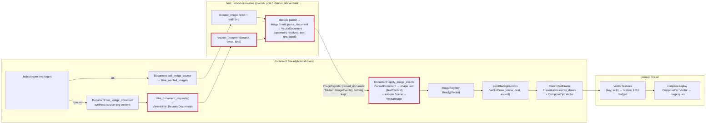

# SVG as the Lynx `<svg>` component: design (2026-10-09)

Status: implemented (2026-10-09; phase 1 contracts C and D, phase 2
contracts A, B and E). What the implementation decided where this document
was silent or wrong is recorded under
[Decisions during implementation](#decisions-during-implementation).
[Revision 4.1](#revision-41-2026-10-10-the-fetcher-parses) (2026-10-10)
moves the parse out of the engine into the resource fetcher; where the
contracts below say the engine parses (`loaded_document`,
`take_pending_documents`, the `parse_document` task, the wasm32 inline
parse), revision 4.1 is what is in force, with the fetcher retaining no
document (ruling 2026-10-11). Where contracts C and D name the vello #1198
plumbing (`opens_blend`, `blend`, `isolate`) or `VectorImage`'s natural
size, the [Simplification pass](#simplification-pass-2026-10-11) is. This
document supersedes `docs/svg-vector-images-design.md`, whose revision 3 (the
standard inline `<svg>` element whose DOM subtree is serialised and parsed by
`usvg`) is withdrawn. Rulings in this document were made by the project owner
on 2026-10-09; everything else is the architect's decision and is marked so.

## Why the inline element goes

Both references treat an SVG as one picture, never as a DOM subtree. web-core
maps the Lynx tag to its `x-svg` element (`web-core/src/constants.rs:50`,
`("svg", "x-svg")`), a shadow `` that observes only `src` and `content`
(`web-elements/src/elements/XSvg/XSvg.ts:20`), renders no light-DOM child and
fires `load` with `{ width, height }`. Native renders `<svg src|content>`
through ServalSVG at the element's layout size. Under the standards policy the
Lynx `<svg>` is a Lynx-only component (bucket 2) that merely shares its name
with the HTML element; revision 3 extended it into something neither reference
has, at the price of three retained copies of every picture (DOM nodes, `usvg`
tree, vello scene), a serialise-and-reparse of the whole subtree at the start
of every layout after any mutation, and a mutation tracker over SVG children.

Measured on 2026-10-08 (release, Apple silicon) for a 47 KB Illustrator export
with 346 nodes, 56 paths and 16 gradients: serialise 114 µs, `roxmltree`
56 µs, `usvg` 525 µs, scene encode 37 µs, per refresh; 67 KB `usvg` tree plus
73 KB scene retained, 140 KB transient. For a 192 B icon: 3.7 µs per refresh.

## Rulings (2026-10-09)

| Topic | Ruling |
|---|---|
| The `svg` tag | The Lynx `<svg>` component: `src` (URL) or `content` (markup), `load` with the element's layout size (the native detail, ruled 2026-10-08). Children generate no box and are never read, as in web-core's `x-svg`. No `error` event (web-core fires none). |
| Parser | An own converter in `dom` over `roxmltree` and `svgtypes`. `usvg` leaves the dependency tree. One converter for every SVG the engine draws: `<svg content>`, `<svg src>`, `<image src="x.svg">`, CSS `url(x.svg)`. |
| CSS inside SVG | Not read: presentation attributes only, no `<style>`, no `style` attribute. Native ServalSVG parity; web-core renders CSS through the browser, recorded deviation; the project keeps one styling engine, stylo, and does not add a second one for SVG. |
| Text | SVG `<text>`/`<tspan>` are drawn. Shaping is parley's, through the document's own `TextContext`, so glyphs come from the same fonts, the same `@font-face` registrations and vello's glyph cache as `<text>`. |
| Fonts (architect's choice under the owner's permission) | Font family, weight, style, stretch and size come from the SVG document's own presentation attributes, inherited down the SVG tree like `fill`; the host element's computed style is not read. The owner allowed either; this one needs no restyle hook on the host, keeps one scene per document shared by every element that draws it, and treats `<image src="x.svg">` identically. A missing `font-family` resolves through the document's default family. |
| Raster | The painter rasterises each vector image with vello `render_to_texture` at the device size of its destination box, caches the texture by `(image key, device width, device height)` under a byte budget with LRU eviction, and draws it as an image quad. The frame carries the scene, never pixels. |
| Removal | Everything that existed only for the inline element (`tree/inline_svg.rs`, `tree/svg_markup.rs`, the mutation hooks, the `width`/`height` presentational-hint reflection, the inline tests and golden) is deleted. |

## Architecture

As of [revision 4.1](#revision-41-2026-10-10-the-fetcher-parses):

## Contracts

### A. The component (`crates/bobcat-core/src/main/tree/svg.rs`)

Restored from the pre-revision-3 module (`git show ff7c88ee^:crates/bobcat-core/src/main/tree/svg.rs`), with these changes:

- `src` → `document.set_image_source(node, ImageRole::Source, Some(url))`, as before; the host fetches and reports `loaded_document(bytes, DocumentKind::Svg)`.
- `content` → `document.set_image_document(node, ImageRole::Source, content.as_bytes(), DocumentKind::Svg)` (contract B). No `data:` URL, no host round trip. An empty or removed `content` keeps the current source (web-core's `_handleContent`), as before; the last attribute written wins.
- `load` detail = the element's border-box layout size read at delivery, 0×0 without a box (as before). A `Failed` outcome fires nothing.
- UA rules: `svg { display: flex; }` and `svg > * { display: none; }`. `svg` stays in the shared box-rule block of `ua_sheet.rs`.
- Registered in `new_document` after `image::define`; `is_svg` returns for the runtime's load-detail branch.

### B. Engine-originated documents (`dom`)

- `Document::set_image_document(node, role, bytes: &[u8], kind) -> Option<ImageOutcome>`: computes a 128-bit content hash (two seeded `SipHasher` passes, or `blake`-free equivalent already in the lock), names the synthetic source `svg-content:<32 hex>`, creates the registry entry `Pending` if unknown and pushes `(source, Bytes, kind)` onto `pending_documents`, then binds like `set_image_source`. A known source (another element with the same markup, or a re-set) binds without a new parse. Identical icons repeated across a list parse once and share one scene and one raster texture.
- `Document::take_pending_documents() -> Vec<(Arc<str>, Bytes, DocumentKind)>`: drained by the runtime next to `take_wanted_images`. Natively `bobcat-core` runs each through the existing `parse_document` task (`main/page.rs`, `spawn_blocking`) and applies the result as a main job; on wasm32 the document parses them inline in `apply_image_events` exactly as it does a host `LoadedDocument`.
- Synthetic entries are forgotten when their last binder unbinds (refcount on the entry, replacing the explicit `forget_synthetic`). The `inline-svg:` prefix and the revision-3 synthetic machinery go.
- `SYNTHETIC_SOURCE_PREFIX` becomes `svg-content:`; `is_synthetic_source` stays so the registry never queues such a source into `wanted`.

### C. The converter (`crates/dom/src/render/svg/`)

Owner: F1. Replaces `paint/svg.rs` and the `usvg` parts of `render/image.rs`.

- `pub(crate) fn parse(bytes: &[u8]) -> Result<VectorDocument, SvgError>`: UTF-8 check, `roxmltree::Document::parse_with_options` (DTD allowed, as today), then one walk producing a `VectorDocument { natural: (u32, u32), viewport: (f32, f32), aspect: AspectRatio, items: Vec<Item>, has_text: bool }`. `natural` and `viewport` follow the existing `vector_sizes` rules (CSS Images 3 default sizing, 300×150 fallback, absolute units in/cm/mm/pt/pc to px); `viewport` is the `viewBox` size when present, else the natural size. `Send + Sync`.
- `Item` is a flat, pre-resolved command list in viewport units with absolute transforms, in paint order: `Path { shape: BezPath, transform: Affine, fill: Option<(Brush, Affine, Fill)>, stroke: Option<(Stroke, Brush, Affine)>, fill_first: bool }`, `PushLayer { blend, alpha, bounds: Rect, transform }`, `PushClip { shape: BezPath, rule: Fill, transform, isolate: bool }`, `Pop`, `Text(TextItem)`. Brushes are final peniko brushes: `objectBoundingBox` gradient units are resolved against the shape's `kurbo` bounding box at conversion; `userSpaceOnUse` against the viewport. Gradient `href` chains inherit stops and attributes. `spreadMethod` → `Extend`. A radial gradient's focal circle maps to peniko's start circle as today.
- Elements: `svg` (root and nested, `x`/`y`/`width`/`height`/`viewBox`/`preserveAspectRatio`), `g`, `a` (as `g`), `defs`, `symbol`, `use` (`href`/`xlink:href`, `x`/`y`, `width`/`height` for a `symbol`/`svg` target, recursion guarded by a reference stack), `path`, `rect` (`rx`/`ry`), `circle`, `ellipse`, `line`, `polyline`, `polygon`, `text`, `tspan`, `clipPath` (`clipPathUnits`, nested `clip-path`, children `path`/shapes/`use`/`text` as paths; a multi-child clip is the concatenation under `NonZero`, the documented approximation), `linearGradient`, `radialGradient`, `stop`, `switch` (first child whose `systemLanguage`/`requiredFeatures` are absent). `image`, `mask`, `filter`, `pattern`, `marker`, `style` (its text is never read), `title`, `desc`, `metadata` and unknown elements produce nothing; a group with `mask` is skipped with its subtree (an unmasked draw would show what the author hid), a `filter` is ignored, a `pattern` paint is `none`.
- Properties, with SVG inheritance (`inherit`, `currentColor` from `color`, `none`, `url(#id) <fallback>`): `fill`, `fill-opacity`, `fill-rule`, `stroke`, `stroke-width`, `stroke-opacity`, `stroke-linecap`, `stroke-linejoin`, `stroke-miterlimit`, `stroke-dasharray`, `stroke-dashoffset`, `paint-order`, `color`, `display`, `visibility`, `opacity` (group, not inherited), `clip-path`, `clip-rule`, `transform` (not inherited), `font-family`, `font-size`, `font-weight`, `font-style`, `font-stretch`, `text-anchor`, `letter-spacing`. Source: the presentation attribute of the same name, and nothing else (ruling "CSS inside SVG"). `mix-blend-mode` and `isolation` have no presentation attribute, so they are not read at all. Lengths: user units, `px`, `%` (of the viewport axis, or of the diagonal for `r`/`stroke-width`), `pt`, `pc`, `mm`, `cm`, `in`, `em`/`ex` of the element's font size (default 16, `ex` = 0.5 em).
- Parsing primitives are `svgtypes` 0.16: `PathParser` (arcs through `kurbo::SvgArc` → cubics), `Transform`, `Paint`, `Color`, `Length`/`LengthListParser`, `PointsParser`, `ViewBox`, `AspectRatio`, `Points`. A malformed path renders up to the error, as the SVG spec and `usvg` do.
- `TextItem { chunks: Vec<TextChunk>, transform: Affine }`, `TextChunk { text: String, x: f32, y: f32, dx: f32, dy: f32, anchor: Start|Middle|End, font: ResolvedFont { families: Vec<String>, size: f32, weight: u16, style: Normal|Italic|Oblique, stretch: f32 }, letter_spacing: f32, fill: Option<(Brush, Affine)>, stroke: Option<(Stroke, Brush, Affine)> }`. A `tspan` with an absolute `x` or `y` starts a chunk; `dx`/`dy` move the running position; only the first value of a list is read (documented subset). Whitespace follows `xml:space` default collapsing. `objectBoundingBox` gradients on text resolve against the chunk's advance box after shaping.
- `pub(crate) fn encode(document: &VectorDocument, context: &mut Option<Box<TextContext>>) -> Scene` and `pub(crate) fn opens_blend(document) -> bool` (the vello #1198 rule the layer around a whole-image draw needs). Text is drawn with `Scene::draw_glyphs` exactly as `paint/text.rs::draw_glyph_run` does (`font_size`, `normalized_coords`, `hint(false)`, brush and brush transform); `text-anchor` shifts the chunk by 0 / half / all of its advance.
- The document's `TextContext` is the shaper: `encode` creates it on the first document with text (`Option<Box<TextContext>>` in the layout state), and `hughie` gains `text::shape_line(ctx: &mut TextContext, text, font, letter_spacing) -> ShapedLine` (a one-line `RangedBuilder` with `FontStack`, `FontSize`, `FontWeight`, `FontStyle`, `FontWidth`, `LetterSpacing`, then `break_all_lines(None)`) because the context's parley handles are `pub(super)`. No shaper trait: the two implementations an earlier draft had differed only in laziness, and no test replaced one.
- `VectorImage { scene: Arc<Scene>, natural, viewport, aspect, key, opens_blend: bool }` with the existing accessors (`natural_size`, `viewport`, `scene`, `key`, `aspect`, `opens_blend`). No tree. Built on the document thread by `Document::apply_image_events` from `ImageEvent::ParsedDocument { source, document: Box<VectorDocument> }`, which is what `ImageEvent::parse_document(source, bytes, kind)` now returns on success (`Failed` otherwise); the name `LoadedVector` goes. A `LoadedDocument` applied directly (wasm32, dom tests) parses then encodes in the same call.
- A later `@font-face` registration does not re-shape already-encoded text (known gap, follow-up).

### D. The painter raster cache

Owner: F2. Precedent: `FilterTextures` in `crates/dom/src/render/blur.rs` (`bake_all`, the texture-backed `ImageData` registered with `renderer.override_image`, `mark_override_image_dirty`).

- Frame side (`paint/background.rs`, `paint/compose.rs`, `visual/frame.rs`): the three vector producers (`paint_replaced_content`, `paint_vector_layer` for backgrounds, the mask layer through `paint_pattern_layer`) stop appending `vector.scene()`. Each visible tile becomes a `VectorDraw { scene: Arc<Scene>, key: u64, viewport: (f32, f32), aspect: AspectRatio, opens_blend: bool, transform: Affine (item-local → device px), anchor: Point, extent: Size, area: ImageArea, alpha-aware sampler }` in `Presentation.vector_draws`, referenced by a new `ComposeOp::Vector { index, space }`. The clip pair and tile loop of today's `fill_vector_tiles` keep their shape; `MAX_TILE_FILLS` still caps the tile count. Culling, hit testing and seams see the op as they see `Image`.
- Painter side: `VectorTextures` (new `crates/dom/src/render/vector_textures.rs`), owned next to `FilterTextures` by `WindowGraphics` and `Headless`, persists across frames. Before composing a frame the painter calls `bank.prepare(frame, renderer, device, queue)`: for every `VectorDraw` it computes the device size `(w, h) = ceil(extent × the per-axis scale of transform)`, clamped to `MAX_RENDERABLE_DIMENSION`; a miss on `(key, w, h)` renders the scene into a fresh `Rgba8Unorm` texture of that size with `render_to_texture`, under the transform that maps `viewport` onto `w × h` by `aspect` (`none` stretches; `meet`/`slice` scale uniformly and align), wrapped in one `Normal` full layer when `opens_blend`, and stores it with its `ImageData` handle (empty blob, premultiplied alpha, `override_image`). Entries used by this frame are pinned; the rest are LRU-evicted when the byte total exceeds the budget (architect's default 64 MB on native, 32 MB on wasm32; a constant, not a setting). Eviction releases the override and the texture.
- Replay (`compose.rs::replay_ops`): `ComposeOp::Vector` looks the draw's texture up in the table the painter passes (as `filtered` is passed) and encodes it through the same path as `ComposeOp::Image` (`encode_draw` with the texture-backed `ImageData`, brush scale = extent / (w, h)); with no texture (budget exceeded for one giant draw) it encodes nothing.
- `Headless::render_frame` (tests, screenshots) bakes the same way, so goldens exercise the cache.
- A scene that is empty (nothing drawable) produces no draw at all, as today, so vello's `FORCE_NEXT_*` flags are never cleared by an empty append.

### E. Deletions and rewrites

Owner: O1, after C and D have merged.

- `dom`: delete `tree/inline_svg.rs`, `tree/svg_markup.rs`, `tests/inline_svg.rs`, `tests/screenshots/svg/inline.png`; remove the hooks in `tree/document.rs` (73-75, 133, 388, 516-517, 705, 881-883), `style/invalidation.rs` (447, 486, 554-555, 733, 744, 755-757), `layout/mod.rs` (77-84); remove the `usvg` dependency; rewrite `tests/svg_images.rs` for the component path and regenerate the four remaining goldens (inspect every PNG).
- `bobcat-core`: contract A; `main/tree/lib.rs` registration; `runtime/lib.rs` load-detail branch; `page.rs` drains `take_pending_documents` into the parse task; `page_tests.rs` SVG tests adapted; `ua_sheet.rs` tests.
- `packages/reactlynx-test-fixtures/src/react-svg`: rewritten to `<svg content={...}>` and `<svg src="...">` cards (inline children removed); `rsbuild.config.js` and `README.md` entries kept.
- Docs: `docs/svg-vector-images-design.md` replaced by a pointer to this document; `AGENTS.md` SVG paragraphs; `docs/tracking/components.md` (the `svg`/`x-svg` row), `docs/tracking/media-resources.md` SVG section, `docs/tracking/deviations.md` SVG entries, `docs/tracking/reactlynx.md:117`, `docs/browser-wasm.md` SVG notes, `docs/dom-public-api.md`.

## Ownership and sequencing

| Phase | Agent | Model | Owns | Must not touch |
|---|---|---|---|---|
| 1 | F1 | Fable 5.1 | `crates/dom/src/render/svg/**`, `render/image.rs` (`VectorImage`, `ImageEvent`, `parse_document`, apply), `visual/mod.rs::apply_image_events`, `crates/hughie/src/text/` (`shape_line`), `paint/svg.rs` (delete), workspace deps (`usvg` out; `roxmltree`, `svgtypes` in), the walker unit tests ported to the converter | `paint/background.rs`, `paint/compose.rs`, `visual/frame.rs`, anything in `bobcat-core` |
| 1 | F2 | Fable 5.1 | `paint/background.rs`, `paint/compose.rs`, `visual/frame.rs`, `render/vector_textures.rs` (new), `render/gpu.rs`, `render/blur.rs` (only if the bank shares code), `bobcat-core/src/paint/{graphics,lib,images}.rs` | `render/image.rs` beyond reading `VectorImage`'s accessors, `render/svg/**`, hughie |
| 2 | O1 | Opus 5.5 | Contract A, B and E | the converter and the raster cache internals |

Both phase-1 agents work against the `VectorImage` accessors committed in the base (`key`, `aspect`, `opens_blend`, `scene`, `viewport`, `natural_size`), so the two branches merge without a shared edit. F1 removes `tree()`; F2 never calls it.

## Memory and performance expectations

Per `<svg content>`: the `content` string once in the DOM attribute, one `Scene` per distinct document (73 KB for the 47 KB illustration, 304 B for an icon), one texture per distinct `(document, device size)` on the GPU (48 px icon at dpr 3: 83 KB; a 390 px illustration at dpr 3: 5.5 MB), nothing on the blocking pool after the parse. Document thread per `content` change: a hash, a bind, and at apply time the text shaping plus one scene encode (37 µs for the illustration). Painter: one `render_to_texture` pass per cache miss, then one quad per draw per frame.

## Known costs and follow-ups

- A texture is per device size: a `transform: scale()` animation on an ancestor samples the texture, so an item scaling from 0.8 to 1 (the swiper's `coverflow`) draws a 0.8-size raster upscaled during the animation. Native does the same. Follow-up if it shows: bake at the largest size an exported scale curve reaches.
- Text shaped before a later `@font-face` arrives keeps its fallback glyphs.
- `image` inside an SVG draws nothing; `mask`, `filter`, `pattern`, `marker` are not supported; `textPath`, per-character `x`/`y` lists, `dominant-baseline`, bidi reordering within a chunk are out.
- A `content` string is parsed once per distinct markup per document, never evicted while an element is bound to it. Nothing outside the document's registry keeps it (revision 4.1, ruling 2026-10-11), so a markup that leaves (its last element lets go) and comes back is parsed again.
- Blend modes inside an SVG need CSS, which is not read: `mix-blend-mode` and `isolation` have no presentation attribute, so every layer the converter opens is `Normal`.

## Decisions during implementation

### Phase 1, converter (F1)

- Chunks are `TextChunk { x, y, anchor, spans }` with per-span style, so `text-anchor` anchors the whole chunk.
- `ShapedLine` carries ascent/descent, and its types live in hughie (`crates/hughie/src/text/line.rs`).
- `Item::PushLayer` clips are `LayerClip::{Bounds, Path}`.
- `VectorDocument` is `pub` without public members.
- A `text` child of a `clipPath` contributes nothing.
- The `font` shorthand is not read.
- `switch` picks the first child without `systemLanguage`/`requiredFeatures`/`requiredExtensions`.

### Phase 1, raster cache (F2)

- Textures are registered with straight alpha (`ImageAlphaType::Alpha`): vello writes straight alpha.
- The monolithic `Document::scene()` draws no vector image.
- Keys are per parse, so one markup in two documents is two textures.
- Per-frame admission is unbounded; the budget bounds retention only.

### Phase 2, component and synthetic sources (O1)

- The hash is SipHash-1-3 with its 128-bit output from `siphasher` 1.0 (already in the lock through `phf`, now a direct dependency of `dom`), one pass keyed with zeros, not two seeded 64-bit passes: the 128-bit variant exists, SipHash folds the length into its last block, and a fixed key gives one markup one name in every document and every run. A known key does not make it collision-resistant against a page that sets out to collide two of its own pictures; such a page only confuses its own drawing (`render/image.rs`, `synthetic_source`).
- The binder count is the entry's existing `(node, role)` list: deduplicated per binding and unbound by `free_node`, its length is the count, so no second counter was added. The last unbind of a synthetic source removes the entry and its still-unparsed bytes; a parse that lands afterwards applies to nothing (`ImageRegistry::apply` refuses a forgotten synthetic source rather than recreating it). Host sources are still never removed.
- `ImageRegistry::bind_node` and the paint walk never queue a synthetic source as wanted. One a page names itself (`<image src="svg-content:…">` or `url(svg-content:…)`) is neither asked for nor filed, since an entry without bytes would make that markup's own later `set_image_document` read it as known and never parse it: it draws the picture while some `<svg content>` holds that markup, and nothing otherwise.
- `Document::take_pending_documents` returns `Vec<dom::PendingDocument>`, a public alias for `(Arc<str>, Bytes, DocumentKind)`. `Document::apply_pending_documents` parses and applies them inline; the wasm32 runtime, the tests and `flashbulb::pump_images` call it, and natively nothing does.
- The page's epilogue drains the pending documents before its commit (`crates/bobcat-core/src/main/page.rs`): natively each goes to the existing `parse_document` task; on wasm32 they are parsed and applied inline so that the same commit draws them. The contract placed the wasm32 parse inside `apply_image_events`; a separate call in the same epilogue does the same without a second path inside `dom`.
- The epilogue's hold on component events while a commit was skipped (`MainThreadRuntime::needs_render`) returns with the component, because an `<svg>`'s `load` reads the layout box at delivery. It was part of the pre-revision-3 component and was removed with it.
- The `react-svg` fixture is consumed by `compiled_svg_component_draws_content_and_src` in `crates/bobcat-source/tests/reactlynx_runtime.rs`, which samples one solid point of each picture; no new golden was added, and the four `dom` SVG goldens did not change.

### Review fixes (independent review, 2026-10-09)

- Nesting is bounded at 256 levels, and in two places: a linear scan (`render/svg/nesting.rs`) cuts every element deeper than the bound, with its content, before `roxmltree` sees the document, because `roxmltree`'s own tokenizer recurses once per nested element and overflows a 2 MiB `spawn_blocking` stack at about 3,000 levels in release and 120 in debug; the converter's walk, `use` expansion and `tspan` collection then carry a depth of their own and refuse the same bound. A document whose entity text could nest markup past the bound is refused (`SvgError::TooDeep`), since entities expand where no cut reaches. `[profile.dev.package.roxmltree] opt-level = 1` in the workspace `Cargo.toml` keeps a debug build's `roxmltree` frames small enough for the bound to hold on that stack.
- A collapsed space stays in the text chunk that produced it when the next character starts another chunk (SVG 1.1 §10.15), so an absolutely positioned `tspan` starts exactly at its `x`.
- A texture clamped to `MAX_RENDERABLE_DIMENSION` places its picture by `preserveAspectRatio` against the real device extent and then scales onto the texture (`VectorDraw::device_extent`, `placement(size, raster)`), so a draw wider than 8192 device px under `meet` keeps its height.
- A gradient stop's `currentColor` is the stop's own inherited `color`, through the gradient element's ancestors, never the referencing shape's; the per-element gradient cache is therefore sound for colour. Known approximation left in place: that cache resolves `userSpaceOnUse` percentages and `em` units with the viewport and font size of the first element that referenced the gradient, which differs only when two referencers sit in different nested viewports or font sizes.
- `flashbulb::pump_images` parses pending documents through `Document::apply_pending_documents` rather than a copy of it.

### CSS inside SVG (ruling 2026-10-09)

- Phase 1 shipped `<style>` rules (matched with `simplecss`, specificity order, `!important`) and the `style` attribute as property sources. The ruling removed both: `render/svg/style.rs`'s `declarations` reads the presentation attributes named in `PROPERTIES` and nothing else, the converter carries no sheet, a `style` element is not rendered and its text is never read, and `simplecss` left the dependency tree.
- `mix-blend-mode` and `isolation` are not read at all: SVG 2 gives them no presentation attribute, browsers accept them only through CSS, and `usvg` refused them as attributes for that reason, so with CSS not read they are unreachable. Every layer the converter opens is `Normal` (gap under [Known costs](#known-costs-and-follow-ups)). The item model's `PushLayer { blend }`, `PushClip { isolate }` and `opens_blend` were kept at first for the raster cache's interface and always computed `false`; see [Simplification pass](#simplification-pass-2026-10-11).

### Simplification pass (2026-10-11)

The owner asked for the SVG code to be simplified alongside the no-retention ruling of revision 4.1. Where contracts C and D above name these items, this is what is in force:

- The vello #1198 plumbing is gone: `Item::PushLayer { blend }`, `Item::PushClip { isolate }`, `opens_blend` on the converter, `VectorImage` and `VectorDraw`, the isolating branch of the inline encoding and the bake's `Normal` wrapper. Nothing could make any of them true without CSS, which is not read; every layer is `Normal` and every clip a clip layer by construction.
- `VectorImage` is crate-private (no other crate could make, receive or read one) and carries what a draw needs only: the scene, the viewport, the `preserveAspectRatio` and the key. The natural size is the registry entry's, as a bitmap's intrinsic size is, and a parsed document is never refused for a zero axis: the converter rounds the natural size to at least one px per axis.

## Revision 4.1 (2026-10-10): the fetcher parses

**Ruling (owner, 2026-10-10).** SVG documents are parsed by the resource
fetcher (`bobcat-resources`), on its decode pool, exactly where bitmaps are
decoded; the engine no longer parses on its own blocking pool. This reverses
revision 2 of 2026-10-08, "the host never names an engine type": the host
protocol may carry the engine's `VectorDocument`, and the bytes of an
`<svg content>` are handed to the host through the request path. Everything
below that is not the ruling is the implementer's decision.

**Ruling (owner, 2026-10-11).** The fetcher retains no parsed document, and
nothing caches a repeated request: a virtual list recycling its rows is not
a scenario the engine optimises for. Documents are parsed and reported,
never retained; the engine owns the scene it encodes. As first written, this
revision kept each parsed document in the fetcher's entry for the fetcher's
life and answered a repeated request from it; [The fetcher](#the-fetcher)
below is the design that replaced that.

### The protocol

- **Reports.** `ImageReports::parsed_document(source, document:
  Arc<VectorDocument>)` posts `ImageEvent::ParsedDocument { source, document:
  Arc<VectorDocument> }`. `ImageReports::loaded_document` and
  `ImageEvent::LoadedDocument` are gone. A document that does not parse is
  reported with the existing `failed(source)`. The document travels in an
  `Arc` rather than by value: one parse of a fetched document is reported
  to every view that joined its load, and each report is then a count bump,
  not a deep copy of the command list (`VectorDocument` is `Clone`, which
  would copy every path).
- **The parser.** `ImageEvent::parse_document(source, bytes, kind) ->
  ImageEvent` stays the one public parser entry. The host calls it on its
  decode thread and takes the document out of the `ParsedDocument` it
  returns, or reports `failed` for `Failed`. A thinner
  `parse(bytes, kind) -> VectorDocument` re-exported through `bobcat-core`
  was the alternative; keeping the existing function adds no public item.
  `DocumentKind` is what the host passes it. `VectorDocument` stays `pub`
  with no public member and `Send + Sync`, and `bobcat-core` now re-exports
  it.
- **Document requests.** `Document::set_image_document` still files the
  synthetic `svg-content:<hash>` source `Pending` with its binder count, and
  identical markup still binds without a new request. Instead of an
  engine-side pending list, the bytes are queued as a document request:
  `Document::take_document_requests() -> Vec<dom::DocumentRequest>`
  (`(Arc<str>, Bytes, DocumentKind)`; formerly `take_pending_documents` and
  `PendingDocument`). The page's epilogue drains it before its commit
  (`MainThreadRuntime::request_documents`), as one
  `ViewNotice::RequestDocuments` beside `RequestImages`, and
  `LynxView::pump` hands each to the new
  `ResourceFetcher::request_document(source, bytes, kind)` after
  `service_images` and the image requests; a failed view hands over
  nothing. The trait method defaults to doing nothing, so an `<svg content>`
  on a host without document support stays pending and draws nothing; the
  `Rc<T>` impl forwards it.
- **The document thread never parses.** `Document::apply_pending_documents`
  is gone, and `Document::apply_image_events` takes `Loaded`,
  `ParsedDocument` and `Failed` only. Applying a `ParsedDocument` shapes its
  text and encodes the scene, as before.

### The fetcher

- **A fetched SVG** (`<image src="x.svg">`, `<svg src>`, CSS `url(x.svg)`) is
  requested as before. After sniffing `ImageFormat::Svg`, the load job takes
  a decode permit and runs the parse in a blocking closure of its own, in the
  decode's place (`images::parse_job`). It completes as
  `Completion::ParsedDocument`, reported to every view waiting on the load,
  or as `Completion::Failed` with a note (`… is not a document the engine
  can draw`) into `Entry::Failed`. A parse that panics is the load's failure,
  as a decode's is. A parsed document leaves `Entry::Parsed`, a unit marker:
  the URL stays known (`knows_image`), as a bitmap's or a failure's does, but
  nothing of the document is kept, so a later request, from the same view
  or another, fetches and parses it again. Requests made while the load is
  in flight still join it, as they do for a bitmap, so no request starts a
  second fetch of a URL already loading.
- **A document request** (`ViewResources::request_document`,
  `images::request_document`) files no entry before, during or after its
  parse. It starts a parse job of its own, with no resolution, no transport
  and no preprocessing, under the same decode permit, and its completion
  (`Completion::RequestedDocument`) reports to the view that asked through
  `ImageState::requested`, a list of the requests in flight with their
  `ImageReports`; that list exists only because a view's reports are
  thread-bound and cannot travel with the job. Two requests for one source
  are two parses and two reports, and the document's registry applies the
  first that finds the source pending. A page that fetches an
  `svg-content:` name itself goes through the URL path like any unknown
  scheme.
- **Reads and memory.** `read` answers `None` and `is_resident` is false
  for a document, and `memory_used_bytes` counts none: nothing is kept to
  count.

### What left `bobcat-core`

- The `parse_document` task in `main/page.rs` with its `spawn_blocking`, the
  `ParseGate` test seam, and the two tests that ended a view during a parse.
  Also `Page::apply_image_events`, which split `LoadedDocument`s out of a
  report batch, `MainThreadRuntime::take_pending_documents`,
  `MainThreadRuntime::apply_pending_documents` and the wasm32 inline path.
  `after_timers` now calls `request_documents` and then commits, so the
  requests still go out before the commit.
- The test-only refused-entry counter on `Lifetime` (`count_refused_entry`,
  `refused_entry_count`), which only those two tests read.
- `DetachingRuntime` in `jobs.rs` and its test. #365 introduced it so that a
  group release would not join a running parse. No other
  blocking-pool user runs on a `JsThread` runtime: `load_font_face` awaits a
  source request and spawns nothing blocking. The runtime is therefore
  dropped plainly again, as it was before #365. A parse in flight at
  teardown now belongs to the fetcher's executor, whose drop already detaches
  running blocking closures (`bobcat-resources/src/executor.rs`, Shutdown).
- `bytes` becomes an unconditional dependency of `bobcat-core`: it is the
  type of `request_document`'s argument.

### flashbulb

`TestImages` acts as the fetcher. `insert_svg(source, markup)` parses with
`ImageEvent::parse_document` and reports `parsed_document`, or `failed`;
the published document is what the store answers that URL with, as
published pixels are. `TestImages::request_document` answers a document
request the same way and keeps nothing: every request is a parse and a
report of its own. `pump_images` drains
`take_document_requests`, the function the runtime drains, answers each
request through `request_document`, and then applies the store's events.
`flashbulb` drops the `bytes` dependency revision 3 gave it and gains
nothing.

### wasm32

The parse leaves the Lynx-main Worker. The Render Worker parses a fetched
document inside the load's local task, after preprocessing, and an
`<svg content>` document in a local task of its own. The Lynx-main Worker
only shapes text and encodes the scene, at apply. Before this revision the
wasm32 build parsed both inline on the Lynx-main Worker, which blocked it
for the parse's duration (#365 recorded that cost, and contract B and the
phase-2 decisions kept it); that cost is gone. The Render Worker, which also
paints, pays the parse instead. The inline path also drew an
`<svg content>` in the commit of the entry that wrote it. On every target
that document now draws in the commit after the host's report, as a URL's
does.

### Known costs

- An `<svg content>` costs one view turn and one report entry, as a fetched
  document does: the request leaves in a notice, the fetcher parses and
  reports, and the report applies in a later entry.
- Nothing is cached for a repeated request (ruling 2026-10-11). The engine
  forgets a synthetic source with its last binder, so a markup that leaves
  and comes back (a virtual list recycling a row) is requested and parsed
  again; a URL another view or a reloaded page asks for is fetched (through
  the transport's own caches) and parsed again. Each such parse costs what
  the first did, and nothing the fetcher holds grows with the number of
  distinct documents.
- The parse now takes a decode permit, so a large SVG and a large bitmap
  queue behind each other under a low `decode_parallelism`. Before
  revision 4.1 a document took no permit.
