# SVG as a vector image: design (2026-10-08)

Status: implemented (PR #365). Rulings in this document were made by the
project owner on 2026-10-08; everything else is the architect's decision and
is marked as such.

## What Lynx requires

Lynx treats an SVG as one image, never as a DOM subtree:

- The `<svg>` element takes `src` (a URL) or `content` (raw SVG markup) and
  fires `bindload`. Native renders it through ServalSVG at the element's
  layout size and supports only `svg g defs use path rect circle ellipse line
  polyline polygon text image clipPath linearGradient radialGradient stop`.
- web-core's `x-svg` and `x-image` are a shadow `` (`content` becomes a
  `Blob` URL), so the browser renders any SVG, and CSS `url()` images may be
  SVG as well.

## Rulings

| Topic | Ruling |
|---|---|
| Route | Own walker over `usvg` into `vello` paths. No `vello_svg` dependency, no raster fallback. |
| `<image src="x.svg">`, `background-image: url(x.svg)`, `mask-image: url(x.svg)` | Render (web-core behaviour; native refuses). |
| Intrinsic size | web-core: CSS Images 3 §4.1 default sizing. Both `width` and `height` absolute → that size; one absolute plus a `viewBox` → the other from the viewBox ratio; `viewBox` only → the largest size with its ratio that fits the default object size 300×150; neither → 300×150. |
| `load` detail | native: the element's layout size. Superseded by revision 3: the standard `<svg>` fires no `load`; `<image src="x.svg">` keeps the `<image>` detail (natural size). |
| `<text>` | Dropped. `usvg` is built without its `text` feature; text elements vanish at parse. |
| `current-color` attribute | Not implemented (web-core lacks it). |
| vello | Upgraded to 0.11 in its own PR (#364). SVG work does not depend on it. |
| The `svg` tag (ruled 2026-10-08, revision 3) | `svg` is the browser's standard `<svg>` element, as a subset: SVG child elements are real DOM nodes, the element is replaced content sized by the standard rules, and its subtree is serialised and parsed by usvg like any other document. The Lynx `<svg src\|content\|bindload>` component is **not provided**: a compiled ReactLynx card's `<svg src>` loses that ability (recorded in `docs/tracking`). URL-loaded SVG remains `<image src="x.svg">` and CSS `url()`. |
| Who parses (ruled 2026-10-08, revision 2) | The engine. The host protocol hands over bytes and a kind, `ImageReports::loaded_document(source, bytes, DocumentKind::Svg)`; `bobcat-core` parses, off the document thread where it has a blocking pool. The host never names `usvg` or `VectorImage`. |

## Architecture

```mermaid
flowchart LR
    subgraph painter["view / painter thread (host)"]
        fetch["bobcat-resources\nfetch + preprocess\nImageFormat::Svg"] --> report["ImageReports::loaded_document\n(source, bytes, DocumentKind::Svg)"]
    end
    report -- "ToMain::ImageEvents\nLoadedDocument { bytes, kind }" --> core["bobcat-core page loop\nnatively: spawn_blocking on the\nJsThread runtime → VectorImage::parse_sealed\nwasm32: parsed inline by dom"]
    core -- "main job: apply LoadedVector / Failed" --> registry["dom ImageRegistry\nReady { natural, kind: Vector(VectorImage) }"]
    subgraph document["document thread"]
        registry --> walk["paint: background.rs\nvector branch"]
        walk --> svg["paint/svg.rs\nusvg::Tree → vello::Scene\n(built once, cached in VectorImage)"]
        svg --> frag["ComposeOp::Fragment\n(scene.append with clip + transform)"]
    end
    frag -- "CommittedFrame" --> replay["painter: replay_ops\nFragment appended verbatim"]
```



Parsing is the engine's: the host's whole contribution to an SVG is the
fetched bytes and the sniffed kind. `dom` owns the parser
(`VectorImage::parse_sealed`), the sizing rule and the walker; `bobcat-core`
owns where the parse runs. Natively the document thread is a tokio
`current_thread` runtime (`jobs.rs`, `JsThread`) whose blocking pool is
idle apart from this, so `spawn_blocking` parses there and a main job applies
the result. On wasm32 there is no blocking pool: `Document::apply_image_events`
parses the document inline on the group's Lynx-main Worker and blocks that
Worker for the parse's duration. Before this revision the browser build parsed
in `bobcat-resources`' local task on the Render Worker, so this is a move of
the parse onto the thread that runs the document and the MTS realm (see Known
costs). `usvg` is a dependency of `dom` alone.

The painter side (`FrameImages`, `ComposeOp::Image`, the bitmap memory tier,
atlas residency) is untouched. A vector image is never in `image_draws`; it is
encoded into the fragment scene on the document thread, exactly like a
gradient, and replayed by the existing `ComposeOp::Fragment` arm.

### bobcat-resources

- No `usvg` dependency and no parse. After preprocessing says
  `Payload::Image { format: ImageFormat::Svg, .. }`, the load takes no decode
  permit and hands nothing to the platform decoder: it completes as
  `Completion::LoadedDocument { source, bytes, kind: DocumentKind::Svg }`,
  which servicing reports as `ImageReports::loaded_document(source, bytes,
  kind)`. The bytes are the preprocessed payload (unchanged for an image).
- The resources-side `Entry` (`images.rs`) has a `Document { bytes, kind }`
  arm: `read` returns `None` (the painter never asks), a repeated `request`
  re-reports `loaded_document` with the same bytes, `knows_image` is true,
  `is_resident` is false, `memory_used_bytes` counts the bytes under the
  encoded-bytes figure (they are what a later asker is answered from; a few
  KB for an icon). Nothing enters the bitmap memory tier.
- A document the engine cannot parse is the engine's failure to report: the
  host has answered correctly by handing the bytes over. `knows_image` stays
  true on the host side; the document registry marks the source `Failed`.
- The browser used to decode SVG through `HTMLImageElement`; the host now
  hands the bytes over on every target, and the engine parses them the same
  way everywhere.

### dom

- Dependency: `usvg` (same spec). Type in `dom::render::image`:

  ```rust
  pub struct VectorImage { /* Arc<usvg::Tree>, natural: (u32, u32), viewport: (f32, f32), OnceLock<Arc<vello::Scene>> */ }
  impl VectorImage {
      pub(crate) fn new(tree: Arc<usvg::Tree>, natural: (u32, u32), viewport: (f32, f32)) -> Self;
      pub(crate) fn parse_sealed(svg: &[u8]) -> Result<Self, usvg::Error>;
      pub(crate) fn natural_size(&self) -> (u32, u32);
      pub(crate) fn viewport(&self) -> (f32, f32);
      pub(crate) fn scene(&self) -> &Arc<vello::Scene>;
  }
  ```
  The type is `pub` only because `ImageEvent::LoadedVector` carries it; no
  method is public, and no crate outside `dom` names it. The one public
  entry to the parse is `ImageEvent::parse_document(source, bytes, kind)`.
  `usvg::Tree` and `vello::Scene` are `Send + Sync`; a static assertion in
  `dom` says so, because the tree crosses from the painter thread to the
  document thread and the cached scene is published inside the registry.
  `Debug` is hand-written (`Scene` has none); `VectorImage` is not
  `PartialEq`.
- Protocol, host-facing: `#[non_exhaustive] pub enum DocumentKind { Svg }`,
  `ImageEvent::LoadedDocument { source, bytes: bytes::Bytes, kind }` and
  `ImageReports::loaded_document(&self, source: &str, bytes: Bytes, kind:
  DocumentKind)`. This is the only way a host delivers an SVG; `loaded_vector`
  is not part of the protocol.
- Engine-internal, still public to `bobcat-core`: `ImageEvent::LoadedVector {
  source, image: VectorImage }`, the already-parsed form `bobcat-core`
  produces after its off-thread parse. `Document::apply_image_events` accepts
  both: a `LoadedDocument` is parsed inline there with
  `VectorImage::parse_sealed` (the path dom tests and the wasm32 build use,
  where no blocking pool exists), a `LoadedVector` is stored as it is, and a
  parse error marks the source `Failed`. `ImageEvent` drops its
  `PartialEq`/`Eq` derives (every consumer matches by pattern; none compares
  events). The "no variant carries pixels" comments on `ImageEvent` and
  `ToMain::ImageEvents` gain "encoded document bytes and a parsed tree are
  not pixels". `ToMain::ImageEvents` is a plain `Vec<dom::ImageEvent>` arm
  with no derives, so `Bytes` and the `Arc<usvg::Tree>` cross soundly.
- Sizing and parse: the crate-private `VectorImage::parse_sealed(svg)` lives
  here, reached from outside `dom` only through `ImageEvent::parse_document`
  (it reads nothing outside the document: `resolve_string` returns `None`,
  `resources_dir` is `None`). One XML parse: `usvg::roxmltree::Document::parse`, the root's
  `width`, `height`, `viewBox` read, then `usvg::Tree::from_xmltree`.
  `usvg::Tree` exposes neither the viewBox nor the raw dimensions, and its
  `size()` is the content bounding box when the root has no viewBox and no
  absolute dimension. Two sizes come out:
  - **natural size**, what layout is told, in CSS px, rounded to whole px,
    minimum 1: (a) `width` and `height` both absolute → that size; (b) one
    absolute plus a `viewBox` → the other from the viewBox ratio; (c)
    `viewBox` only → the largest size with the viewBox ratio that fits
    300×150; (d) neither → 300×150; (e) one absolute and no `viewBox` →
    that axis, with 300 wide or 150 high for the other. A dimension is
    absolute when it is a bare number or a length in one of the CSS
    absolute units, converted to px at 96 px per inch: `px`, `in` (96),
    `cm` (96/2.54), `mm` (96/25.4), `pt` (4/3), `pc` (16). `em`, `ex`,
    percentages and any other unit count as absent.
  - **viewport**, the rectangle in tree units the fragment maps onto the
    draw rectangle: `tree.size()` in cases (a), (b) and (c); the natural
    size in cases (d) and (e), where usvg leaves user units 1:1 and
    overwrites `size()` with the content bounding box.
  The append transform is `extent / viewport`, never `extent /
  tree.size()`.
- `ImageRegistry`: `ImageState::Ready { width, height, kind }` with
  `ImageKind::Raster | Vector(VectorImage)`. `ImageState` stops being
  `Copy`/`PartialEq`; the call sites that moved it out of a borrow switch to
  `match &entry.state` / `matches!(.., ImageState::Pending)`. `resolve`
  additionally hands back `Option<&VectorImage>` as a borrow (no `Arc`
  clone per draw per frame). The "never regresses" rule is unchanged:
  `Pending` is the only state with outgoing edges.
- `paint/svg.rs`: the walker. `fn encode(tree: &usvg::Tree, scene: &mut
  vello::Scene)` plus `VectorImage::scene(&self) -> &Arc<Scene>` which builds
  once. Rules:
  - A node's placement is `node.abs_transform()` as usvg gives it; no parent
    multiplication.
  - Group: a layer only when `group.should_isolate()`. With opacity ≠ 1 or
    blend ≠ Normal: `push_layer(Fill::NonZero, blend, alpha,
    group.abs_transform(), shape)` where `shape` is the clip path when the
    clip has exactly one path child, else the group's `layer_bounding_box`
    (object units, so the group transform is the right one). With a clip
    but opacity 1 and Normal blend: `push_clip_layer`, no compositing layer.
    `isolate` alone (opacity 1, Normal blend, no clip) pushes nothing. A
    `clipPath` with several children clips with the concatenation of all
    child paths under `Fill::NonZero` (documented approximation: the exact
    result is a union); a `clipPath` whose own `clip_path()` is set pushes
    that one first. A clipPath is a usvg subroot with its own transform, so
    a clip child is placed at `group.abs_transform() * clip.transform() *
    child.abs_transform()`, the product resvg uses. A group with a `mask`
    is **skipped** (drawing it unmasked could reveal content the author
    hid). A group with `filters` is drawn **without** the filter. Groups
    usvg did not need are already inlined by usvg (`convert_group` keeps
    only `<g>`/`<use>` and isolating groups), so there is no per-element
    layer cost for plain shapes.
  - Path: `fill` with the usvg fill rule, `stroke` with width/cap/join/miter
    limit/dash array/dash offset, in `paint_order`. Invisible paths skipped.
  - Brush: solid colours as RGBA8 with the paint opacity folded in. Linear
    gradients map `spreadMethod` to `Extend::Pad | Repeat | Reflect`.
    Radial gradients map SVG's focal circle to peniko's start circle and the
    outer circle to the end circle:
    `Gradient::new_two_point_radial((fx, fy), fr, (cx, cy), r)`. The
    gradient `transform()` is the brush transform. Stops fold their opacity.
    `Paint::Pattern` draws nothing (documented gap).
  - `Node::Image`: nested raster images draw nothing in this change
    (documented follow-up); a nested SVG image renders its tree.
  - `Node::Text`: unreachable with the text feature off.
  - BezPath conversion follows the tiny-skia-path segment semantics: a
    `Close` followed by a non-`MoveTo` segment re-moves to the subpath start.
- `paint/background.rs`: where a resolved image is a vector, the three
  producers of `ImageDraw` (`paint_replaced_content`, `paint_raster_layer`,
  `paint_pattern_layer` for mask layers) instead encode inline into
  `sink.scene_for(space)`:
  - destination rectangle, `object-fit`, `object-position`, tile size,
    `background-size`, position and repeat are computed by the same code as
    for a raster image, from the registry's natural size;
  - for each visible tile (the existing `fill_gradient_tiles` loop and its
    `MAX_TILES_PER_AXIS` cap are the precedent), push a clip for the
    `ImageArea` shape, `scene.append(vector.scene(), Some(transform *
    translate(tile_origin) * scale(extent / viewport)))`, pop. The clip
    pair stays inside one painter call so a fragment cut can never land
    between them.
  - a vector whose cached scene is empty (nothing drawable) encodes nothing
    at all: no clip pair, no append. `Encoding::append` copies the other
    scene's `flags`, and an empty append would clear the
    `FORCE_NEXT_TRANSFORM | FORCE_NEXT_STYLE` bits a preceding glyph run
    set, so the next path's transform could be wrongly deduplicated. Making
    the empty case unreachable is the fix, not a guard elsewhere.
- Tests: walker unit tests on hand-written SVG strings (path fill rules,
  stroke dashes, gradients with spread methods and focal circles, group
  opacity, single- and multi-child clipPath, masked group skipped, nested
  svg), plus flashbulb golden screenshots for `<image src>`,
  `background-image` with repeat, `mask-image`, and the `<svg>` element.
  `flashbulb::TestImages` gains `insert_svg(source, &str)`, which reports
  `loaded_document` with `DocumentKind::Svg`, so a dom test exercises the
  inline parse in `apply_image_events` and flashbulb has no `usvg`
  dependency.

### bobcat-core: where the parse runs

- In the page loop's `ToMain::ImageEvents(events)` arm, natively: every
  `LoadedDocument` is taken out of the batch and parsed with
  `tokio::task::spawn_blocking(move || ImageEvent::parse_document(source,
  &bytes, kind))` on the `JsThread` runtime's blocking pool; the rest of the
  batch is applied at once. `ImageEvent::parse_document` is `dom`'s: it
  matches on the `#[non_exhaustive]` `DocumentKind` (so `bobcat-core` needs
  no wildcard arm), runs `VectorImage::parse_sealed` for `Svg`, and answers
  `LoadedVector` or `Failed`. A parse that panics (a `JoinError`) applies
  `Failed`. When the parse returns, a main job applies one event,
  `LoadedVector` or `Failed`, through the same `runtime.apply_image_events`
  as the view's own batches, so the outcome, the natural-size relayout and
  the `load` event follow the existing path. The job follows the
  `load_font_face` precedent for reaching the runtime from an awaited
  completion, and is cancelled by the view's `Lifetime` like every other
  pending completion: a view that ends mid-parse applies nothing.
- Group teardown does not wait for a parse in flight. `JsThread` shuts its
  runtime down with `shutdown_background` once the queue and the `LocalSet`
  are gone, so a blocking parse still running is detached rather than joined
  and finishes on its own pool thread, its result dropped there. A plain
  runtime drop joins every blocking-pool thread, and `bobcat-main` is joined
  by `LynxGroup`'s release on the embedder's thread, so one slow parse would
  stall the embedder. The parse closure owns only the bytes (`Bytes`) and
  the source URL (`Arc<str>`), so a detached parse holds nothing of the
  group.
- On wasm32 the batch is applied unchanged and `dom` parses the
  `LoadedDocument` inline in `Document::apply_image_events`, on the Lynx-main
  Worker, which the parse blocks for its duration.
- The registry stays `Pending` while a parse is in flight; a second
  `LoadedDocument` for the same source (two views, or a re-request) parses
  again and the registry's "never regresses" rule makes the later apply a
  no-op.
- `bobcat-core` has no direct `usvg` dependency; it calls `dom`'s parse.

### dom: the standard `<svg>` element (subset)

The element lives in `dom`, the browser-DOM layer, not in `bobcat-core`: it
is the standard element, not a Lynx component. Nothing about it is
host-visible.

- **What it is.** Every element named `svg` is replaced content from its
  creation (`NodeContent::Replaced`, so `is_replaced()` is true from creation
  and layout treats it as a leaf, hiding its children as it hides an
  `<image>`'s). A node's *inline SVG root* is the topmost `svg` on the walk up
  from it (a text node starts at its parent) for as long as each element's
  name is one usvg 0.48 reads (its `EId` list, 53 names); a mutation under an
  element usvg does not know is not tracked, since usvg drops that element
  with its subtree. That list contains `text` and `image`, so an `svg` under
  a Lynx `<text>` or `<image>` is still a root of its own.
  Its descendants are ordinary DOM nodes (`path`, `rect`, `circle`, `g`,
  `defs`, `linearGradient`, `stop`, `clipPath`, `use`, `style`, nested
  `svg`, …): JavaScript creates and mutates them through the element PAPI as
  it does any element, and selectors match them. A nested `svg` is part of
  its outer root's document, never a root of its own.
- **How it draws.** The root's subtree is serialised to SVG markup (root tag
  with `xmlns="http://www.w3.org/2000/svg"` and
  `xmlns:xlink="http://www.w3.org/1999/xlink"` added, every element's
  attributes escaped and written as they are, including `style`, text
  content kept so `<style>` sheets reach usvg; author `xmlns`/`xmlns:*`
  attributes dropped, and an attribute or element whose name would fail the
  XML parse skipped, the element with its subtree; no other namespace
  handling; shadow trees excluded) and parsed through the same `ImageEvent::parse_document`
  as a fetched document, inline on the document thread (browsers parse
  inline SVG on the main thread as well). The result is stored in the
  `ImageRegistry` under a synthetic source the host never sees (the entry is
  created settled, so `wanted` never names it and no `request_image` is ever
  made for it), and the root is bound to that source as `ImageRole::Source`.
  From there the existing path draws it: natural size into layout,
  `paint_replaced_content`'s vector branch, the cached scene appended per
  frame. A superseded generation's registry entry is forgotten when the root
  rebinds (synthetic entries are the one kind the registry removes; a host
  source still never regresses).
- **When it re-renders.** Any mutation inside an inline SVG root (an
  attribute set or removed on the root or a descendant, a child inserted,
  removed or moved, a text node changed) marks the root dirty, gated by a
  count of live `svg` elements; the start of the next `Document::layout`
  (which `render` and `commit` run, and which every caller that reads layout
  goes through) serialises every dirty root once before style and layout. The root's own `width`/`height` attributes additionally become
  presentational hints for CSS `width`/`height` (the SVG presentation
  attributes they are), so `<svg width="48" height="48">` lays out at 48×48
  through the cascade, and author CSS still overrides them. A bare number
  is px; any other value goes to the CSS parser as written, and one it
  refuses leaves no hint.
- **Sizing.** With no CSS size the natural size is what
  `VectorImage::parse_sealed` reports for the serialised document: the root
  attributes' size, or a `viewBox` ratio fitted into 300×150, or 300×150.
  Subset deviation, recorded: a browser sizes an inline `<svg>` with a
  `viewBox` and no `width`/`height` to its containing block's width; here it
  gets the `` rule, which keeps one sizing rule for every SVG. A
  second, from the same replaced-element path: a root whose CSS box does not
  have its `viewBox`'s ratio stretches the picture to the box
  (`object-fit: fill`, the initial value), where a browser letterboxes it by
  the root's `preserveAspectRatio` (default `xMidYMid meet`).
- **What the subset leaves out.** SVG descendants are not styled by the
  engine's cascade (presentation attributes, `style` attributes and `<style>`
  elements inside the SVG are what usvg sees); they are not hit-tested and
  take no events; the root fires no `load`; `<text>`, masks, filters and
  patterns follow the walker's gaps; and there are no `src`/`content`
  attributes.
- **UA rule.** `svg { display: flex; }` in the Lynx UA sheet, with `svg` in
  the shared box-rule list, so an inline SVG root lays out like `<image>`
  does. No rule hides its children: the replaced leaf already does.

### Removed with revision 3 (ablation list)

Everything that existed only for the Lynx `<svg src|content>` component:

- `crates/bobcat-core/src/main/tree/svg.rs` as a `CustomElement` (`src`
  binding, `content` as a percent-encoded `data:` URL and its encoder,
  `is_svg`), and its registration in `new_document`.
- The `svg`-specific `load` detail (layout size via `bounding_client_rect`)
  and the `Failed`-fires-nothing arm in `dispatch_component_events`.
- The `!needs_render()` hold on posting component events in the page
  epilogue, introduced only so that detail could read a laid-out box.
- The `svg > * { display: none; }` UA rule.
- The page-level `<svg>` tests and the `react-svg` fixture's `src`/`content`
  cases; the fixture now uses inline `<svg>` children.
- `docs/tracking` rows that described the Lynx component as implemented.

Kept: `DocumentKind`, `loaded_document`, the core off-thread parse, the
walker, the vector branch, `<image src="x.svg">`, CSS `url()`.

### Known costs

- A repeated vector background re-encodes the whole cached scene once per
  visible tile, up to the existing `MAX_TILE_FILLS` cap
  (`paint/background.rs`), so its cost scales with the document's path
  count times the tile count. A 1 000-path document under
  `background-size: 2px` is the worst case. No cap by path count is
  applied, so the picture stays complete.
- On wasm32 the parse blocks the Lynx-main Worker: `Document::apply_image_events`
  parses inline there, so the document, the MTS realm and every other view of
  the group wait for the parse's duration. Before this revision the browser
  build parsed in `bobcat-resources`' local task on the Render Worker, which
  runs neither the document nor a realm.

### Out of scope, documented

`<text>`, `current-color`, `mask`, `filter`, `pattern`, nested raster
`<image>`, `.svgz`, percentage and font-relative `width`/`height` on the
root, `clipPath` unions with overlapping opposite-winding children, the Lynx
`<svg src|content|bindload>` component (see "Removed with revision 3"), and
`load` on the standard `<svg>`. The stretch of a sized root's picture to a
CSS box without its `viewBox`'s ratio (see "Sizing") stays a known gap, and
no `object-fit` UA rule stands in for it: the correct route, a follow-up, is
paint-side `preserveAspectRatio` against the CSS box, with the viewport set
to the `viewBox` and the root's `preserveAspectRatio` stored on the parsed
image.

## Dependency note

`usvg` 0.48.1 is the latest release at the time of writing (2026-08-02),
which satisfies the "latest available versions" policy. With
`default-features = false` it brings `data-url`, `imagesize`, `kurbo`
(unifies with the lock), `log`, `pico-args` (serves the usvg binary, not
optional, dead weight accepted), `roxmltree` (unifies), `simplecss`,
`siphasher` (unifies), `strict-num` → `float-cmp`, `svgtypes`,
`tiny-skia-path` → `arrayref`, `bytemuck` (unifies), `libm` (unifies).
`usvg` is declared by `dom` only; `bobcat-core` reaches the parser through
`dom::ImageEvent::parse_document`, and `bobcat-resources` and `flashbulb`
hand over bytes only.
Nine crates new to the lock, each at a single version, no duplicate of an
existing crate, `rkyv` pin untouched.

## Why these choices

- A fragment, not a bitmap: the frame already appends prebuilt scenes with a
  transform (`ComposeOp::Fragment`); a vector image is that op with a clip.
  Nothing on the painter thread changes and no bitmap budget is spent.
- The document thread builds the scene because that is where the paint
  decisions (object-fit, tiling) are made and where the registry lives; the
  tree is tiny and `Send + Sync`, so it rides the existing `ImageEvents`
  message.
- Bytes across the protocol, not a parsed tree: a host should not have to
  know an engine type to answer a fetch, and a second engine-drawn format
  later (a Lottie document, say) is one more `DocumentKind` arm rather than a
  second protocol method. The cost is that the parse moved from a pool the
  host already had to the engine's own blocking pool, which the `JsThread`
  runtime provides natively for free. On wasm32 it moved from
  `bobcat-resources`' local task on the Render Worker to an inline parse in
  `Document::apply_image_events` on the Lynx-main Worker, which blocks that
  Worker for the parse's duration (see Known costs).
- Masks skipped rather than drawn unmasked: an unmasked draw is a wrong
  picture that looks right; nothing drawn is a visible gap.
