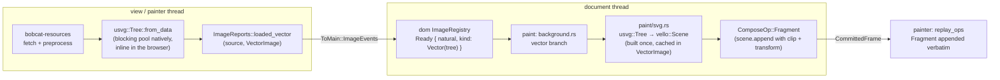

# SVG as a vector image: design (2026-10-08)

Status: approved design, implementation in progress. Rulings in this document
were made by the project owner on 2026-10-08; everything else is the
architect's decision and is marked as such.

## What Lynx requires

Lynx treats an SVG as one image, never as a DOM subtree:

- The `<svg>` element takes `src` (a URL) or `content` (raw SVG markup) and
  fires `bindload`. Native renders it through ServalSVG at the element's
  layout size and supports only `svg g defs use path rect circle ellipse line
  polyline polygon text image clipPath linearGradient radialGradient stop`.
- web-core's `x-svg` and `x-image` are a shadow `` (`content` becomes a
  `Blob` URL), so the browser renders any SVG, and CSS `url()` images may be
  SVG as well.

## Rulings

| Topic | Ruling |
|---|---|
| Route | Own walker over `usvg` into `vello` paths. No `vello_svg` dependency, no raster fallback. |
| `<image src="x.svg">`, `background-image: url(x.svg)`, `mask-image: url(x.svg)` | Render (web-core behaviour; native refuses). |
| Intrinsic size | web-core: CSS Images 3 §4.1 default sizing. Both `width` and `height` absolute → that size; one absolute plus a `viewBox` → the other from the viewBox ratio; `viewBox` only → the largest size with its ratio that fits the default object size 300×150; neither → 300×150. |
| `load` detail | native: the element's layout size, not the document's intrinsic size. |
| `<text>` | Dropped. `usvg` is built without its `text` feature; text elements vanish at parse. |
| `current-color` attribute | Not implemented (web-core lacks it). |
| vello | Upgraded to 0.11 in its own PR (#364). SVG work does not depend on it. |

## Architecture



The painter side (`FrameImages`, `ComposeOp::Image`, the bitmap memory tier,
atlas residency) is untouched. A vector image is never in `image_draws`; it is
encoded into the fragment scene on the document thread, exactly like a
gradient, and replayed by the existing `ComposeOp::Fragment` arm.

### bobcat-resources

- Dependency: `usvg = { version = "0.48", default-features = false }` in the
  workspace. No `text`, `system-fonts`, `memmap-fonts`, `svgz`, `writer`
  features. (`.svgz` therefore fails to parse; documented gap.)
- In the image pipeline, after preprocessing says
  `Payload::Image { format: ImageFormat::Svg, .. }`, the bytes go to usvg
  instead of the platform decoder, on the same blocking-pool thread natively
  and inline on wasm32. One XML parse: `usvg::roxmltree::Document::parse`
  (usvg re-exports roxmltree, which is already in the lock at the version
  usvg needs), read the root's `width`, `height` and `viewBox`, then
  `usvg::Tree::from_xmltree(&doc, &options)`. `usvg::Tree` exposes neither
  the viewBox nor the raw dimensions, and its `size()` is the content
  bounding box when the root has no viewBox and no absolute dimension.
  `usvg::Options`:
  - `image_href_resolver`: `resolve_string` returns `None` (never the
    default, which reads the filesystem); `resolve_data` stays default.
  - `resources_dir: None`, everything else default.
- A parsed tree completes as `Completion::LoadedVector { source, image:
  VectorImage }`; a parse error completes as `Completion::Failed` with the
  usvg error message. Servicing reports `ImageReports::loaded_vector`.
- The resources-side `Entry` (`images.rs`) gains a `Vector(VectorImage)`
  arm: `read` returns `None` (the painter never asks), a repeated `request`
  re-reports `loaded_vector`, `knows_image`/`is_resident` answer as for a
  loaded image with no resident bitmap. Nothing enters the bitmap memory
  tier and the encoded bytes are dropped after parse.
- Two sizes travel with the tree, both computed from the root attributes
  (architect's decision, implements the ruling):
  - **natural size**, what layout is told, in CSS px, rounded to whole px,
    minimum 1: (a) `width` and `height` both absolute → that size; (b) one
    absolute plus a `viewBox` → the other from the viewBox ratio; (c)
    `viewBox` only → the largest size with the viewBox ratio that fits
    300×150; (d) neither → 300×150. Percentage dimensions count as absent.
  - **viewport**, the rectangle in tree units the fragment maps onto the
    draw rectangle: `tree.size()` in cases (a), (b) and (c) (usvg folds the
    viewBox into the root transform and `size()` is the viewBox size or the
    attribute size); the natural 300×150 in case (d), where usvg leaves user
    units 1:1 and overwrites `size()` with the content bounding box.
  The append transform is `extent / viewport`, never `extent /
  tree.size()`.
- The browser used to decode SVG through `HTMLImageElement`; it now goes
  through usvg like every target, so all three behave the same.

### dom

- Dependency: `usvg` (same spec). Public type in `dom::render::image`:

  ```rust
  pub struct VectorImage { /* Arc<usvg::Tree>, natural: (u32, u32), viewport: (f32, f32), OnceLock<Arc<vello::Scene>> */ }
  impl VectorImage {
      pub fn new(tree: Arc<usvg::Tree>, natural: (u32, u32), viewport: (f32, f32)) -> Self;
      pub fn natural_size(&self) -> (u32, u32);
  }
  ```
  `usvg::Tree` and `vello::Scene` are `Send + Sync`; a static assertion in
  `dom` says so, because the tree crosses from the painter thread to the
  document thread and the cached scene is published inside the registry.
  `Debug` is hand-written (`Scene` has none); `VectorImage` is not
  `PartialEq`.
- `ImageEvent::LoadedVector { source, image }` and
  `ImageReports::loaded_vector(&self, source: &str, image: VectorImage)`.
  `ImageEvent` drops its `PartialEq`/`Eq` derives (every consumer matches by
  pattern; none compares events). The "no variant carries pixels" comments
  on `ImageEvent` and `ToMain::ImageEvents` gain "a parsed vector tree is not
  pixels". `ToMain::ImageEvents` is a plain `Vec<dom::ImageEvent>` arm with
  no derives, so the `Arc<usvg::Tree>` crosses soundly.
- `ImageRegistry`: `ImageState::Ready { width, height, kind }` with
  `ImageKind::Raster | Vector(VectorImage)`. `ImageState` stops being
  `Copy`/`PartialEq`; the call sites that moved it out of a borrow switch to
  `match &entry.state` / `matches!(.., ImageState::Pending)`. `resolve`
  additionally hands back `Option<&VectorImage>` as a borrow (no `Arc`
  clone per draw per frame). The "never regresses" rule is unchanged:
  `Pending` is the only state with outgoing edges.
- `paint/svg.rs`: the walker. `fn encode(tree: &usvg::Tree, scene: &mut
  vello::Scene)` plus `VectorImage::scene(&self) -> &Arc<Scene>` which builds
  once. Rules:
  - A node's placement is `node.abs_transform()` as usvg gives it; no parent
    multiplication.
  - Group: a layer only when `group.should_isolate()`. With opacity ≠ 1 or
    blend ≠ Normal: `push_layer(Fill::NonZero, blend, alpha,
    group.abs_transform(), shape)` where `shape` is the clip path when the
    clip has exactly one path child, else the group's `layer_bounding_box`
    (object units, so the group transform is the right one). With a clip
    but opacity 1 and Normal blend: `push_clip_layer`, no compositing layer.
    `isolate` alone (opacity 1, Normal blend, no clip) pushes nothing. A
    `clipPath` with several children clips with the concatenation of all
    child paths under `Fill::NonZero` (documented approximation: the exact
    result is a union); a `clipPath` whose own `clip_path()` is set pushes
    that one first. A clipPath is a usvg subroot with its own transform, so
    a clip child is placed at `group.abs_transform() * clip.transform() *
    child.abs_transform()`, the product resvg uses. A group with a `mask`
    is **skipped** (drawing it unmasked could reveal content the author
    hid). A group with `filters` is drawn **without** the filter. Groups
    usvg did not need are already inlined by usvg (`convert_group` keeps
    only `<g>`/`<use>` and isolating groups), so there is no per-element
    layer cost for plain shapes.
  - Path: `fill` with the usvg fill rule, `stroke` with width/cap/join/miter
    limit/dash array/dash offset, in `paint_order`. Invisible paths skipped.
  - Brush: solid colours as RGBA8 with the paint opacity folded in. Linear
    gradients map `spreadMethod` to `Extend::Pad | Repeat | Reflect`.
    Radial gradients map SVG's focal circle to peniko's start circle and the
    outer circle to the end circle:
    `Gradient::new_two_point_radial((fx, fy), fr, (cx, cy), r)`. The
    gradient `transform()` is the brush transform. Stops fold their opacity.
    `Paint::Pattern` draws nothing (documented gap).
  - `Node::Image`: nested raster images draw nothing in this change
    (documented follow-up); a nested SVG image renders its tree.
  - `Node::Text`: unreachable with the text feature off.
  - BezPath conversion follows the tiny-skia-path segment semantics: a
    `Close` followed by a non-`MoveTo` segment re-moves to the subpath start.
- `paint/background.rs`: where a resolved image is a vector, the three
  producers of `ImageDraw` (`paint_replaced_content`, `paint_raster_layer`,
  `paint_pattern_layer` for mask layers) instead encode inline into
  `sink.scene_for(space)`:
  - destination rectangle, `object-fit`, `object-position`, tile size,
    `background-size`, position and repeat are computed by the same code as
    for a raster image, from the registry's natural size;
  - for each visible tile (the existing `fill_gradient_tiles` loop and its
    `MAX_TILES_PER_AXIS` cap are the precedent), push a clip for the
    `ImageArea` shape, `scene.append(vector.scene(), Some(transform *
    translate(tile_origin) * scale(extent / viewport)))`, pop. The clip
    pair stays inside one painter call so a fragment cut can never land
    between them.
  - a vector whose cached scene is empty (nothing drawable) encodes nothing
    at all: no clip pair, no append. `Encoding::append` copies the other
    scene's `flags`, and an empty append would clear the
    `FORCE_NEXT_TRANSFORM | FORCE_NEXT_STYLE` bits a preceding glyph run
    set, so the next path's transform could be wrongly deduplicated. Making
    the empty case unreachable is the fix, not a guard elsewhere.
- Tests: walker unit tests on hand-written SVG strings (path fill rules,
  stroke dashes, gradients with spread methods and focal circles, group
  opacity, single- and multi-child clipPath, masked group skipped, nested
  svg), plus flashbulb golden screenshots for `<image src>`,
  `background-image` with repeat, `mask-image`, and the `<svg>` element.
  `flashbulb::TestImages` gains `insert_svg(source, &str)` that parses with
  usvg and reports `loaded_vector`.

### bobcat-core: the `<svg>` element

- `crates/bobcat-core/src/main/tree/svg.rs`, tag `svg`, a `CustomElement`
  following `image.rs`: observed attributes `src` and `content`.
  - `src` → `document.set_image_source(element, ImageRole::Source, source)`.
  - `content` → the same call with the source
    `data:image/svg+xml;charset=utf-8,<percent-encoded content>` so the
    whole image pipeline, including `data:` parsing, is reused with no new
    code path. Percent-encode every byte outside RFC 3986 unreserved
    (`A-Z a-z 0-9 - . _ ~`); the `data:` parser cuts at the first `#`, so
    anything less is a bug. The last attribute written wins, as in web-core
    where `src` and `content` both end up assigning `img.src` (web-core uses
    a Blob URL for `content`; the data URL is the equivalent here).
  - Cost to know: the full data URL is the key in both the dom registry and
    the resources entry map, and neither evicts, so every distinct inline
    `content` an element is ever given stays resident (tree plus cached
    scene) for the document's life. The bitmap tier does not apply by
    design. Acceptable for icons; recorded as a known cost.
  - No placeholder, no `blur-radius`, no `mode`.
- UA rules (architect's decision, mirrors
  `lynx-stack/packages/web-platform/web-elements/src/elements/XSvg/x-svg.css`,
  which is `x-svg { contain: content; display: flex; }` plus a shadow `img`
  inheriting width/height with `max-width/height: 100%`): `svg { display:
  flex; }` without `contain: size`, so an `<svg>` with no CSS size lays out
  at its natural size and a sized one stretches (`object-fit: fill`, the
  replaced-element default). web-core's `contain: content` is not adopted:
  the element is a replaced leaf here and has nothing to contain. `svg > *
  { display: none; }`. `svg` joins the shared box-rule selector list in
  `ua_sheet.rs`.
- Events: `load` only (the Lynx `<svg>` typing and web-core's `x-svg` both
  expose `bindload` alone; an `svg` node's failure dispatches nothing).
  Non-bubbling, through the existing `ImageOutcomes` path. For `svg` nodes
  the `load` detail is the element's border-box layout size in px
  (ruling), not the intrinsic size: `dispatch_image_outcomes` asks the
  document for the node's tag and, for `svg`, reads
  `bounding_client_rect(node)` at dispatch time. Ordering: the page
  epilogue posts the outcome entry only once `needs_render()` is false, so
  the outcome is delivered after the commit that applied the natural size;
  without that hold, a commit skipped while stylesheets are pending would
  let the event read a stale box. A `display: none` `<svg>` has no box and
  reports 0×0 (native reports its zero frame the same way).

### Out of scope, documented

`<text>`, `current-color`, `mask`, `filter`, `pattern`, nested raster
`<image>`, `.svgz`, percentage `width`/`height` on the root, `clipPath`
unions with overlapping opposite-winding children, `error` on `<svg>`.

## Dependency note

`usvg` 0.48.1 is the latest release at the time of writing (2026-08-02),
which satisfies the "latest available versions" policy. With
`default-features = false` it brings `data-url`, `imagesize`, `kurbo`
(unifies with the lock), `log`, `pico-args` (serves the usvg binary, not
optional, dead weight accepted), `roxmltree` (unifies), `simplecss`,
`siphasher` (unifies), `strict-num` → `float-cmp`, `svgtypes`,
`tiny-skia-path` → `arrayref`, `bytemuck` (unifies), `libm` (unifies).
Nine crates new to the lock, each at a single version, no duplicate of an
existing crate, `rkyv` pin untouched.

## Why these choices

- A fragment, not a bitmap: the frame already appends prebuilt scenes with a
  transform (`ComposeOp::Fragment`); a vector image is that op with a clip.
  Nothing on the painter thread changes and no bitmap budget is spent.
- The document thread builds the scene because that is where the paint
  decisions (object-fit, tiling) are made and where the registry lives; the
  tree is tiny and `Send + Sync`, so it rides the existing `ImageEvents`
  message.
- `content` as a `data:` URL: the only alternative is a second registration
  path for inline bytes, which would be a copy of what `data:` already does.
- Masks skipped rather than drawn unmasked: an unmasked draw is a wrong
  picture that looks right; nothing drawn is a visible gap.
